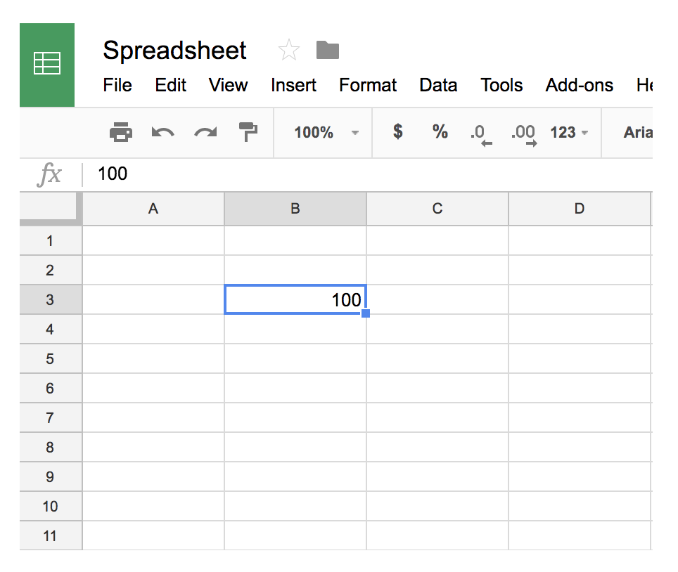
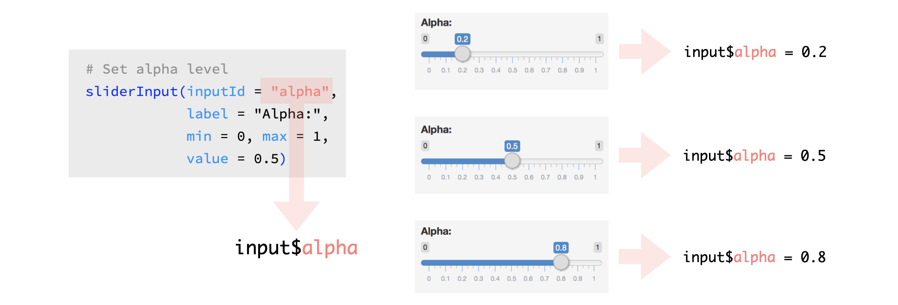
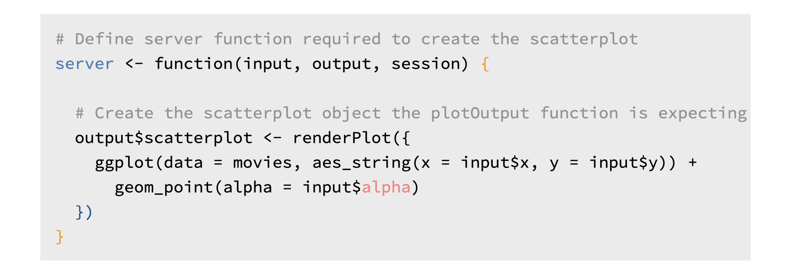
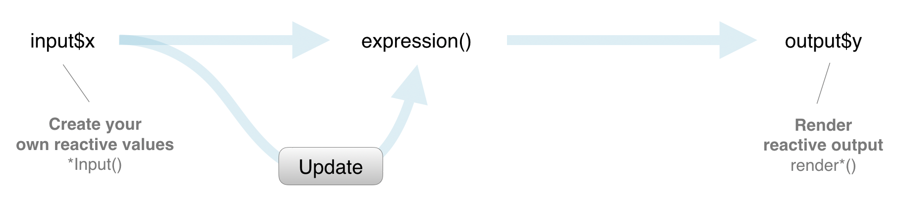
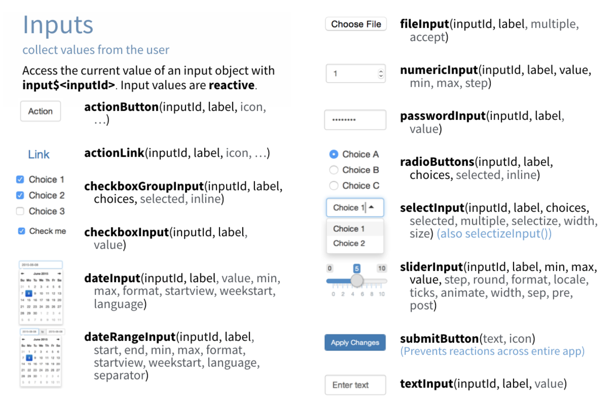
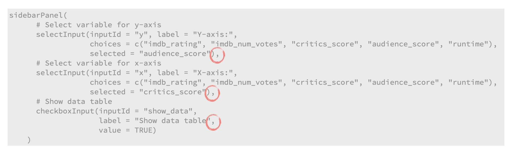
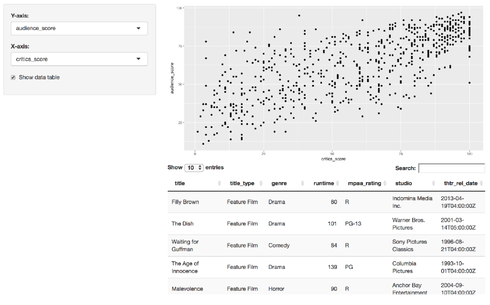

```{r setup, include=FALSE}
library(learnr)
library(shiny)
library(tidyverse)
library(usethis)
library(devtools)
library(rsconnect)

knitr::opts_chunk$set(
  echo = FALSE, 
  fig.align = "center",
  out.width = "100%"
  )
```

## 2.1 Reactive flow

### Reactivity, in spreadsheets

One familiar way of thinking about reactivity is to think in the context of a spreadsheet, like Google Sheets or Microsoft Excel.

```{r, out.width = "80%"}
knitr::include_graphics("images/spreadsheet-1.png")
```

### 

Suppose you write a value into a cell in a spreadsheet...

```{r, out.width = "80%"}

```

### 

and then in another cell you write a formula that depends on that cell.

```{r, out.width = "80%"}
knitr::include_graphics("images/spreadsheet-3.png")
```

### 

First, the formula is calculated with the value you originally typed.

```{r, out.width = "80%"}
knitr::include_graphics("images/spreadsheet-4.png")
```

### 

Now when you change the value of the original cell, the result of the formula will automatically update, or in other words, react to this change.

```{r, out.width = "80%"}
knitr::include_graphics("images/spreadsheet-5.png")
```

### Reactions

In a Shiny app reactivity happens in a similar fashion. 

Suppose you have a `sliderInput` in your app with the `inputId` of `alpha`. The value of this input is stored in `input$alpha`.

```{r}

```

So when the user moves around the slider, the value of the alpha input is updated in the input list.

### Reactivity 101

Reactivity automatically occurs when an input value is used to render an output object, i.e. in the `server` function below the plot is re-rendered when the value of `input$alpha` changes based on user input. You, as the app developer, do not need to write code that says *"Update the plot every time the value of `input$alpha` changes"*, Shiny automatically takes care of this for you in the `render*()` function.

```{r}

```

### Reactive flow

Here is a roadmap of the reactive flow in Shiny, though for now we'll just focus on the straight path between an input and an output, and discuss the other features later in the course.

```{r, out.width = "100%"}
knitr::include_graphics("images/reactive-flow.png")
```

### Reactive flow, simplified

```{r, out.width = "100%"}

```

The user selects an input, this input goes through some expression in the server, and an output is rendered. Each time the user changes their input selection, the expression that generates the output will automatically re-execute, and the relevant output will be re-rendered based on the new value of the input. 

In a Shiny application, there’s no need to explictly describe the relationships between inputs and outputs and tell R what to do when each input changes, Shiny automatically handles these details for you.

### Practice: Building a reactive widget

As we saw in the previous sections, reactivity is established by linking an input with an output via a `render*()` function.

#### Your turn

- Add a new input widget, a `sliderInput`, that controls the transparency of the plotted points. This widget should have the ID `alpha` and its values should range between 0 and 1. You can decide what the displayed label and initial value of the slider should be.

- Make the associated update in the server function.

:::proj

*Complete the exercise by navigating to the RStudio Cloud Project titled __2-1a Building a reactive widget__ in your RStudio Workspace*

[<i class="fa fa-cloud"></i> Go to RStudio Cloud Project](https://rstudio.cloud/spaces/81721/join?access_code=I4VJaNsKfTqR3Td9hLP7E1nz8%2FtMg6Xbw9Bgqumv){.btn .test-drive}

:::


```{r ex-2-1a-build-reactive, echo = TRUE, eval = FALSE}
# Load packages ----------------------------------------------------------------

library(shiny)
library(ggplot2)

# Load data --------------------------------------------------------------------

load("movies.RData")

# Define UI --------------------------------------------------------------------

ui <- fluidPage(
  
  sidebarLayout(
    
    sidebarPanel(
      
      selectInput(inputId = "y", 
                  label = "Y-axis:",
                  choices = c("imdb_rating", "imdb_num_votes", "critics_score", "audience_score", "runtime"), 
                  selected = "audience_score"),
      
      selectInput(inputId = "x", 
                  label = "X-axis:",
                  choices = c("imdb_rating", "imdb_num_votes", "critics_score", "audience_score", "runtime"), 
                  selected = "critics_score"),
      
      # Set alpha level
      sliderInput(inputId = ___, 
                  label = ___, 
                  min = ___, max = ___, 
                  value = ___)
    ),
    
    mainPanel(
      plotOutput(outputId = "scatterplot")
    )
  )
)

# Define server ----------------------------------------------------------------

server <- function(input, output, session) {
  
  output$scatterplot <- renderPlot({
    ggplot(data = movies, aes_string(x = input$x, y = input$y)) +
      geom_point(alpha = ___)
  })
  
}

# Create the Shiny app object --------------------------------------------------

shinyApp(ui = ui, server = server)
```

<details>
<summary>Show solution</summary>

See the following code chunk for the solution to the exercise above. 

```{r ex-2-1a-build-reactive-solution, echo = TRUE, eval = FALSE}
# Load packages ----------------------------------------------------------------

library(shiny)
library(ggplot2)

# Load data --------------------------------------------------------------------

load("movies.RData")

# Define UI --------------------------------------------------------------------

ui <- fluidPage(
  sidebarLayout(
    sidebarPanel(
      selectInput(
        inputId = "y",
        label = "Y-axis:",
        choices = c("imdb_rating", "imdb_num_votes", "critics_score", "audience_score", "runtime"),
        selected = "audience_score"
      ),

      selectInput(
        inputId = "x",
        label = "X-axis:",
        choices = c("imdb_rating", "imdb_num_votes", "critics_score", "audience_score", "runtime"),
        selected = "critics_score"
      ),

      sliderInput(
        inputId = "alpha",
        label = "Alpha:",
        min = 0, max = 1,
        value = 0.5
      )
    ),

    mainPanel(
      plotOutput(outputId = "scatterplot")
    )
  )
)

# Define server ----------------------------------------------------------------

server <- function(input, output, session) {
  output$scatterplot <- renderPlot({
    ggplot(data = movies, aes_string(x = input$x, y = input$y)) +
      geom_point(alpha = input$alpha)
  })
}

# Create the Shiny app object --------------------------------------------------

shinyApp(ui = ui, server = server)
```

</details>

### Practice: Dude, where's my plot?

The server function of this app builds two plots, `scatterplot` and `densityplot`, however the app only displays one.

#### Your turn

- Run the app and identify which plot is missing
- Make the necessary update to the app UI to display the missing plot
- Reduce the height of the new plot using the `height` argument in the `plotOutput()` function (suggested height: `height = 200`)

*Hint:* Make sure you place commas as appropriate.

:::proj

*Complete the exercise by navigating to the RStudio Cloud Project titled __2-1b Dude wheres my plot __ in your RStudio Workspace*

[<i class="fa fa-cloud"></i> Go to RStudio Cloud Project](https://rstudio.cloud/spaces/81721/join?access_code=I4VJaNsKfTqR3Td9hLP7E1nz8%2FtMg6Xbw9Bgqumv){.btn .test-drive}

:::


```{r ex-2-1b-where-plot, echo = TRUE, eval = FALSE}
# Load packages ----------------------------------------------------------------

library(shiny)
library(ggplot2)

# Load data --------------------------------------------------------------------

load("movies.RData")

# Define UI --------------------------------------------------------------------

ui <- fluidPage(
  
  sidebarLayout(
    
    sidebarPanel(
      
      selectInput(inputId = "y",
                  label = "Y-axis:",
                  choices = c("imdb_rating", "imdb_num_votes", "critics_score", "audience_score", "runtime"),
                  selected = "audience_score"),
      
      selectInput(inputId = "x",
                  label = "X-axis:",
                  choices = c("imdb_rating", "imdb_num_votes", "critics_score", "audience_score", "runtime"),
                  selected = "critics_score")
    ),
    
    mainPanel(
      plotOutput(outputId = "scatterplot")
    )
  )
)

# Define server ----------------------------------------------------------------

server <- function(input, output, session) {
  
  output$scatterplot <- renderPlot({
    ggplot(data = movies, aes_string(x = input$x, y = input$y)) +
      geom_point()
  })
  
  output$densityplot <- renderPlot({
    ggplot(data = movies, aes_string(x = input$x)) +
      geom_density()
  })
  
}

# Create the Shiny app object --------------------------------------------------

shinyApp(ui = ui, server = server)
```


<details>
<summary>Show solution</summary>

See the following code chunk for the solution to the exercise above. 

```{r ex-2-1b-where-plot-solution, echo = TRUE, eval = FALSE}
# Load packages ----------------------------------------------------------------

library(shiny)
library(ggplot2)

# Load data --------------------------------------------------------------------

load("movies.RData")

# Define UI --------------------------------------------------------------------

ui <- fluidPage(
  sidebarLayout(
    sidebarPanel(
      selectInput(
        inputId = "y",
        label = "Y-axis:",
        choices = c("imdb_rating", "imdb_num_votes", "critics_score", "audience_score", "runtime"),
        selected = "audience_score"
      ),

      selectInput(
        inputId = "x",
        label = "X-axis:",
        choices = c("imdb_rating", "imdb_num_votes", "critics_score", "audience_score", "runtime"),
        selected = "critics_score"
      )
    ),

    mainPanel(
      plotOutput(outputId = "scatterplot"),
      plotOutput(outputId = "densityplot", height = 200)
    )
  )
)

# Define server ----------------------------------------------------------------

server <- function(input, output, session) {
  output$scatterplot <- renderPlot({
    ggplot(data = movies, aes_string(x = input$x, y = input$y)) +
      geom_point()
  })

  output$densityplot <- renderPlot({
    ggplot(data = movies, aes_string(x = input$x)) +
      geom_density()
  })
}

# Create the Shiny app object --------------------------------------------------

shinyApp(ui = ui, server = server)
```

</details>


## 2.2 UI Inputs

### 

The goal of this section is to build familiarity with a few UI input functions.

### 

Once again, we'll build on our simple movie browser app.

```{r, out.width = "100%"}
knitr::include_graphics("images/app-selectinput-scatterplot.png")
```

### 

Shiny provides a wide selection of input widgets. The Shiny cheatsheet is a great place to see a list of them all at once. 

Once you know which one you want to use, you can find out more about it in the package documentation. You'll also get a chance to work with some of them in the following exercises.

```{r, out.width = "80%"}

```

### checkboxInput

Let's start with a `checkboxInput()`. 

Suppose we want to add checkbox input to our app to specify whether the data plotted should be shown in a data table. We need to make three modifications to our app to accomplish this.

1. In the **ui**: Add an input widget that the user can interact with to check/uncheck the box.

1.In the **ui**: Add an output to the UI defining where the data table should appear.

1. In the **server** function: Add a reactive expression that creates the data table if the checkbox is checked.

We'll go through these steps one by one.

### 1. **ui**: Add an input widget that the user can interact with to check/uncheck the box

```{r, eval = FALSE, echo = TRUE}
# Show data table
checkboxInput(inputId = "show_data",
              label = "Show data table", 
              value = TRUE)
```

* The first argument is the `inputId`, which we can define to be anything we want, but short and informative names are the best. 
* Next is the `label`, which is the user facing description of the widget. 
* And last is the `value`, the initial value of the widget. `TRUE` means the box is initially checked. If you want it to not be checked initially, you'd set it to `FALSE` instead. 

### Watch for commas!

A cautionary tale before we move on -- watch for your commas! Remember that this widget definition goes in the `sidebarPanel()`. In this panel we separate out widget with commas. 

```{r snippet-commas, echo = TRUE, eval = FALSE}
sidebarPanel(
    # Select variable for y-axis 
    selectInput(inputId = "y", label = "Y-axis:",
                choices = c("imdb_rating", "imdb_num_votes", "critics_score", "audience_score", "runtime"),
                selected = "audience_score"),  
    # Select variable for x-axis
    selectInput(inputId = "x", label = "X-axis:",
                choices = c("imdb_rating", "imdb_num_votes", "critics_score",  
"audience_score", "runtime"),
selected = "critics_score"),
    # Show data table 
    checkboxInput(inputId = "show_data",
                  label = "Show data table", value = TRUE)   
 )
```

```{r, out.width = "80%"}

```

For example:

- The first is the `selectInput` widget for y, then we have a comma,
- then another `selectInput` and another comma, and 
- then our new `checkboxInput` and no comma after it since it's the last item in the list.

### 2. **ui**: Add an output to the UI defining where the data table should appear.

```{r snippet-dt, eval = FALSE, echo = TRUE}
mainPanel(
  # Show scatterplot
  plotOutput(outputId = "scatterplot"), 
  # Show data table
  dataTableOutput(outputId = "movestable")
)
```

The second step was to add an output to the UI defining where the data table should appear. Note that for this we're using the `dataTableOutput()` function. 

This function takes one argument, the `outputId`. Again, you can define to be anything we want, but short and informative names are the best.

### 3. **server**: Add a reactive expression that creates the data table if the checkbox is checked.

```{r, eval = FALSE, echo = TRUE}
# Print data table if checked 
output$moviestable <- renderDataTable({
  if(input$show_data){
    DT::datatable(data = movies %>% select(1:7),
                  options = list(pageLength = 10),
                  rownames = FALSE)
  } 
})
```

Lastly, in our server, we describe how this table should be calculated. We use the `renderDataTable()` function to build this table. 

Note that the first line of code in the function is an if statement, telling the app to only do this if `input$show_data` is `TRUE`. We also specify some other arguments to `datatable()`, mostly for cosmetic reasons.

### 

Here is the resulting app, with the box **checked**:

```{r, out.width = "80%"}

```

and box **unchecked**: 

```{r, out.width = "80%"}

```

### Scoping 

A quick note on scoping: 

We saw that the data loaded on top of the Shiny app, outside of ui and server definitions, is visible to the server. That's how we were able to plot the data simply by referring to the data frame by name. The data frame is actually also visible to the UI as well. So our UI inputs could be defined programmatically.

We'll give an example for this, not with an interactive widget but instead with a static HTML statement: 

```{r, eval = FALSE, echo = TRUE}
# Display number of observations
HTML(paste0("The dataset has ", nrow(movies), 
            "observations."))
```

### Practice: Add numericInput

The app below allows users to randomly select a desired number of movies, and displays some information on the selected movies in a tabular output. This table is created using a new function, `renderDataTable()`, but for now we will keep our focus on the `numericInput()` widget. We will also learn to define variables outside of the app so that they can be used in multiple spots to make our code more efficient.

#### Your turn 

- Make sure entries in the `sidebarPanel()` are separated by commas

- Calculate `n_total` (total number of movies in the data set) as `nrow(movies)` before defining the UI.

- Use `n_total` instead of the hard-coded `"651"` in the helper text.

- Add `min` and `max` values to the `numericInput()` widget, where min is 1 and max is `n_total`.

- Change the default `value` of the sample size to 30.

- Change the `step` parameter of `numericInput()` such that values increase by 1 (instead of 10) when the up arrow is clicked in the numeric input widget in the app UI.

:::proj

*Complete the exercise by navigating to the RStudio Cloud Project titled __2-2a Add numericInput __ in your RStudio Workspace*

[<i class="fa fa-cloud"></i> Go to RStudio Cloud Project](https://rstudio.cloud/spaces/81721/join?access_code=I4VJaNsKfTqR3Td9hLP7E1nz8%2FtMg6Xbw9Bgqumv){.btn .test-drive}

:::

```{r ex-2-2a-numericInput, echo = TRUE, eval = FALSE}
# Load packages ----------------------------------------------------------------

library(shiny)
library(ggplot2)
library(dplyr)
library(DT)

# Load data --------------------------------------------------------------------

load("movies.RData")

# Define UI --------------------------------------------------------------------

ui <- fluidPage(
  
  sidebarLayout(
    
    sidebarPanel(
      
      HTML(paste("Enter a value between 1 and", "651"))
      
      numericInput(inputId = "n",
                   value = 3,
                   step = 10)
      
    ),
    
    mainPanel(
      DT::dataTableOutput(outputId = "moviestable")
    )
  )
)

# Define server ----------------------------------------------------------------

server <- function(input, output, session) {
  
  output$moviestable <- DT::renderDataTable({
    movies_sample <- movies %>%
      sample_n(input$n) %>%
      select(title:studio)
    DT::datatable(data = movies_sample, 
                  options = list(pageLength = 10), 
                  rownames = FALSE)
  })
  
}

# Create the Shiny app object --------------------------------------------------

shinyApp(ui = ui, server = server)
```

<details>
<summary>Show solution</summary>

See the following code chunk for the solution to the exercise above. 

```{r ex-2-2a-numericInput-solution, echo = TRUE, eval = FALSE}
# Load packages ----------------------------------------------------------------

library(shiny)
library(ggplot2)
library(dplyr)
library(DT)

# Load data --------------------------------------------------------------------

load("movies.RData")
n_total <- nrow(movies)

# Define UI --------------------------------------------------------------------

ui <- fluidPage(
  sidebarLayout(
    sidebarPanel(
      HTML(paste("Enter a value between 1 and", n_total)),

      numericInput(
        inputId = "n",
        label = "Sample size:",
        value = 30,
        min = 1, max = n_total,
        step = 1
      )
    ),

    mainPanel(
      dataTableOutput(outputId = "moviestable")
    )
  )
)

# Define server ----------------------------------------------------------------

server <- function(input, output, session) {
  output$moviestable <- renderDataTable({
    movies_sample <- movies %>%
      sample_n(input$n) %>%
      select(title:studio)
    DT::datatable(
      data = movies_sample,
      options = list(pageLength = 10),
      rownames = FALSE
    )
  })
}

# Create a Shiny app object ----------------------------------------------------

shinyApp(ui = ui, server = server)
```

</details>

### Practice: req

The app below is the one you developed in the previous exercise. 

- Highlight the code and run it. 
- Then, delete the numeric value. 

You will encounter an error: `Error: size is not a numeric or integer vector`. 

In order to avoid such errors, which users of your app could very easily encounter, we need to hold back the output from being calculated if the input is missing. 

The `req()` function is the simplest and best way to do this, it ensures that values are available ("[truthy](https://shiny.rstudio.com/reference/shiny/latest/req.html)") before proceeding with a calculation or action. If any of the given values is not truthy, the operation is stopped by raising a "silent" exception (not logged by Shiny, nor displayed in the Shiny app's UI).

#### Your turn

- Add `req(input$n)` in the `renderDataTable()` function in the server before `movies_sample` is calculated.

- Run your app again and delete the input sample size to confirm that the error doesn't appear, and neither does the output table.

:::proj

*Complete the exercise by navigating to the RStudio Cloud Project titled __2-2b req__ in your RStudio Workspace*

[<i class="fa fa-cloud"></i> Go to RStudio Cloud Project](https://rstudio.cloud/spaces/81721/join?access_code=I4VJaNsKfTqR3Td9hLP7E1nz8%2FtMg6Xbw9Bgqumv){.btn .test-drive}

:::

```{r ex-2-2b-req, echo = TRUE, eval = FALSE}
# Load packages ----------------------------------------------------------------

library(shiny)
library(ggplot2)
options("shiny.sanitize.errors" = FALSE) # Turn off error sanitization

# Load data --------------------------------------------------------------------

load("movies.RData")
n_total <- nrow(movies)

# Define UI --------------------------------------------------------------------

ui <- fluidPage(
  
  sidebarLayout(
    
    sidebarPanel(
      
      HTML(paste("Enter a value between 1 and", n_total)),
      
      numericInput(inputId = "n",
                   label = "Sample size:",
                   value = 30,
                   min = 1, max = n_total,
                   step = 1)
      
    ),
    
    mainPanel(
      DT::dataTableOutput(outputId = "moviestable")
    )
  )
)

# Define server ----------------------------------------------------------------

server <- function(input, output, session) {
  
  output$moviestable <- DT::renderDataTable({
    movies_sample <- movies %>%
      sample_n(input$n) %>%
      select(title:studio)
    datatable(data = movies_sample, 
              options = list(pageLength = 10), 
              rownames = FALSE)
  })
  
}

# Create a Shiny app object ----------------------------------------------------

shinyApp(ui = ui, server = server)
```

<details>
<summary>Show solution</summary>

See the following code chunk for the solution to the exercise above. 

```{r ex-2-2b-req-solution, echo = FALSE, eval = FALSE}
# Load packages ----------------------------------------------------------------

library(shiny)
library(ggplot2)
options("shiny.sanitize.errors" = FALSE) # Turn off error sanitization

# Load data --------------------------------------------------------------------

load("movies.RData")
n_total <- nrow(movies)

# Define UI --------------------------------------------------------------------

ui <- fluidPage(
  sidebarLayout(
    sidebarPanel(
      HTML(paste("Enter a value between 1 and", n_total)),

      numericInput(
        inputId = "n",
        label = "Sample size:",
        value = 30,
        min = 1, max = n_total,
        step = 1
      )
    ),

    mainPanel(
      dataTableOutput(outputId = "moviestable")
    )
  )
)

# Define server ----------------------------------------------------------------

server <- function(input, output, session) {
  output$moviestable <- renderDataTable({
    req(input$n)
    movies_sample <- movies %>%
      sample_n(input$n) %>%
      select(title:studio)
    datatable(
      data = movies_sample,
      options = list(pageLength = 10),
      rownames = FALSE
    )
  })
}

# Create a Shiny app object ----------------------------------------------------

shinyApp(ui = ui, server = server)
```

</details>

### Practice: Select to selectize

The app below can be used to display movies from selected studios. Currently you can only choose one studio, but we'll modify it to allow for multiple selections. Additionally, there are 211 unique studios represented in this dataset, we need a better way to select than to scroll through such a long list, and we address that with the `selectize` option, which will suggest names of studios as you type them. 

#### Your turn 

- View the help function for the `selectInput` widget by typing `?selectInput` in the console, and figure out how to enable the `selectize` and `multiple` selection options (or whether they are enabled by default).

- Based on your findings add the necessary arguments to the `selectInput` widget.

- Add a call to the `req()` function in the server, just like you did in the previous exercise but this time `req`uiring that `input$studio` be available.

- Run the app and (1) confirm that you can select multiple studios, (2) start typing "Warner Bros" to confirm `selectize` works, and (3) delete all selections to confirm `req` is preventing an error from being displayed.

- Now try with `selectize = FALSE`: Start typing "Warner Bros" and see how the behaviour changed.


:::proj

*Complete the exercise by navigating to the RStudio Cloud Project titled __2-2c Select to selectize__ in your RStudio Workspace*

[<i class="fa fa-cloud"></i> Go to RStudio Cloud Project](https://rstudio.cloud/spaces/81721/join?access_code=I4VJaNsKfTqR3Td9hLP7E1nz8%2FtMg6Xbw9Bgqumv){.btn .test-drive}

:::

```{r ex-2-2c-selectize, echo = TRUE, eval = FALSE}
# Load packages ----------------------------------------------------------------

library(shiny)
library(ggplot2)
library(dplyr)
library(DT)

# Load data --------------------------------------------------------------------

load("movies.RData")
all_studios <- sort(unique(movies$studio))

# Define UI --------------------------------------------------------------------

ui <- fluidPage(
  sidebarLayout(
    
    sidebarPanel(
      selectInput(inputId = "studio",
                  label = "Select studio:",
                  choices = all_studios,
                  selected = "20th Century Fox")
      
    ),
    
    mainPanel(
      DT::dataTableOutput(outputId = "moviestable")
    )
  )
)

# Define server ----------------------------------------------------------------

server <- function(input, output, session) {
  
  output$moviestable <- renderDataTable({
    movies_from_selected_studios <- movies %>%
      filter(studio == input$studio) %>%
      select(title:studio)
    DT::datatable(data = movies_from_selected_studios, 
              options = list(pageLength = 10), 
              rownames = FALSE)
  })
  
}

# Create a Shiny app object ----------------------------------------------------
shinyApp(ui = ui, server = server)
```

<details>
<summary>Show solution</summary>

See the following code chunk for the solution to the exercise above. 

```{r ex-2-2c-selectize-solution, echo = TRUE, eval = FALSE}
# Load packages ----------------------------------------------------------------

library(shiny)
library(ggplot2)
library(dplyr)
library(DT)

# Load data --------------------------------------------------------------------

load("movies.RData")
all_studios <- sort(unique(movies$studio))

# Define UI --------------------------------------------------------------------

ui <- fluidPage(
  sidebarLayout(

    # Input(s)
    sidebarPanel(
      selectInput(
        inputId = "studio",
        label = "Select studio:",
        choices = all_studios,
        selected = "20th Century Fox",
        multiple = TRUE
      )
    ),

    # Output(s)
    mainPanel(
      dataTableOutput(outputId = "moviestable")
    )
  )
)

# Server
server <- function(input, output, session) {

  # Create data table
  output$moviestable <- renderDataTable({
    req(input$studio)
    movies_from_selected_studios <- movies %>%
      filter(studio %in% input$studio) %>%
      select(title:studio)
    DT::datatable(
      data = movies_from_selected_studios,
      options = list(pageLength = 10),
      rownames = FALSE
    )
  })
}

# Create a Shiny app object ----------------------------------------------------

shinyApp(ui = ui, server = server)
```

</details>

### Practice: Convert `dateInput` to `dateRangeInput`

The app below can be used to display movies from a particular date onwards. Instead we would like to select movies between two given dates. Hence we need to convert the `dateInput` widget to `dateRangeInput`. This input will yield a vector (`input$date`) of length two: the first element is the start date and the second is the end date. 

#### Your turn 

- Review the help files for the two widgets by typing `?dateInput` and `?dateRangeInput` in the console.

- Update `dateInput` to `dateRangeInput`, instead of just a start date (`value`) specify `start` and `end` dates, Jan 1, 2013 and Jan 1, 2014, respectively.

- Update the explanatory text to reflect the new functionality of the app.

- Change the `startview` to `"year"` to make it a bit easier for the user to navigate the calendar.

- Update how subsetting is being done in the server function: we need movies released at or after the start date and at or before the end date.

- Add the necessary `req` statement to the server to stop the app from trying to create a plot when no dates are specified.

:::proj

*Complete the exercise by navigating to the RStudio Cloud Project titled __2-2d Convert dateInput to dateRangeInput__ in your RStudio Workspace*

[<i class="fa fa-cloud"></i> Go to RStudio Cloud Project](https://rstudio.cloud/spaces/81721/join?access_code=I4VJaNsKfTqR3Td9hLP7E1nz8%2FtMg6Xbw9Bgqumv){.btn .test-drive}

:::

```{r ex-2-2d-dates, echo = TRUE, eval = FALSE}
# Load packages ----------------------------------------------------------------

library(shiny)
library(ggplot2)
library(dplyr)

# Load data --------------------------------------------------------------------

load("movies.RData")
min_date <- min(movies$thtr_rel_date)
max_date <- max(movies$thtr_rel_date)

# Define UI --------------------------------------------------------------------

ui <- fluidPage(
  sidebarLayout(
    
    sidebarPanel(
      
      HTML(paste0("Movies released since the following date will be plotted. 
                 Pick a date between ", min_date, " and ", max_date, ".")),
      
      br(), br(),
      
      dateInput(inputId = "date",
                label = "Select date:",
                value = "2013-01-01",
                min = min_date, max = max_date)
    ),
    
    mainPanel(
      plotOutput(outputId = "scatterplot")
    )
  )
)

# Define server ----------------------------------------------------------------

server <- function(input, output, session) {
  
  output$scatterplot <- renderPlot({
    movies_selected_date <- movies %>%
      filter(thtr_rel_date >= as.POSIXct(input$date))
    ggplot(data = movies_selected_date, aes(x = critics_score, y = audience_score, color = mpaa_rating)) +
      geom_point()
  })
  
}

# Create a Shiny app object ----------------------------------------------------

shinyApp(ui = ui, server = server)
```

<details>
<summary>Show solution</summary>

See the following code chunk for the solution to the exercise above. 

```{r ex-2-2d-dates-solution, echo = TRUE, eval = FALSE}
# Load packages ----------------------------------------------------------------

library(shiny)
library(ggplot2)
library(dplyr)

# Load data --------------------------------------------------------------------

load("movies.RData")
min_date <- min(movies$thtr_rel_date)
max_date <- max(movies$thtr_rel_date)

# Define UI --------------------------------------------------------------------

ui <- fluidPage(
  sidebarLayout(
    sidebarPanel(
      HTML(paste0("Movies released between the following dates will be plotted. 
                  Pick dates between ", min_date, " and ", max_date, ".")),

      br(), br(),

      dateRangeInput(
        inputId = "date",
        label = "Select dates:",
        start = "2013-01-01", end = "2014-01-01",
        min = min_date, max = max_date,
        startview = "year"
      )
    ),

    mainPanel(
      plotOutput(outputId = "scatterplot")
    )
  )
)

# Define server ----------------------------------------------------------------

server <- function(input, output, session) {
  output$scatterplot <- renderPlot({
    req(input$date)
    movies_selected_date <- movies %>%
      filter(thtr_rel_date >= as.POSIXct(input$date[1]) & thtr_rel_date <= as.POSIXct(input$date[2]))
    ggplot(data = movies_selected_date, aes(x = critics_score, y = audience_score, color = mpaa_rating)) +
      geom_point()
  })
}

# Create a Shiny app object ----------------------------------------------------

shinyApp(ui = ui, server = server)
```

</details>

## 2.3 `render*()` functions

### 

The goal of this section is to build familiarity with a few rendering functions.

###

As we mentioned earlier in the course, Shiny provides a wide selection of output types, each of which works with a render function. We looked at the `renderPlot()` function before. 

```{r}
knitr::include_graphics("images/cheatsheet-outputs.png")
```

### 

Now let's take a look at the `renderTable()` function.  

```{r}
knitr::include_graphics("images/cheatsheet-renderTable.png")
```

### 

This is the app you've seen numerous times so far that we will use as our starting point.

```{r}
knitr::include_graphics("images/app-selectinput-scatterplot.png")
```

### 

And this is the final app that we want to achieve, with a summary table beneath the plot.  

```{r}
knitr::include_graphics("images/app-summary-table.png")
```

### `renderTable`

So we want to add a summary table beneath the plot displaying summary statistics for a new variable we'll create: `score_ratio`, the ratio of audience scores to critics scores.

```{r, eval = FALSE}
score_ratio = audience_score / critics_score
```

We need to make four modifications to our app to accomplish this.

1. Calculate the new variable
1. In the **ui**: Add an input widget that the user can interact with to check boxes for selected title types.
1. In the **ui**: Add an output defining where the summary tables should appear.
1. In the **server** function: Add a reactive expression that creates the summary table. 

We'll go through these steps one by one.

### 1. Calculate the new variable. 

```{r, eval = FALSE, echo = TRUE}
# Create new variable:
# ratio of critics and audience scores
movies <- movies %>%
  mutate(score_ratio = audience_score / critics_score)
```

First is creating the new variable, which we can do outside of the ui and the server so it's calculated once when our app launches. 

There are many ways one can create the new variable in R. We do so here using the `mutate()` function from the `dplyr` package.

### 2. **ui**: Add an input widget that the user can interact with to check boxes for selected title types.

```{r, eval = FALSE, echo = TRUE }
# Subset for title types
checkboxGroupInput(inputId = "selected_title_type", 
                   label = "Select title type:", 
                   choices = levels(moves$title_type),
                   selected = levels(movies$title_type))
```

- The first argument is the `inputId`. 
- Next is the user facing `label`. 
- Third, we define the `choices`. Previously we manually entered the choices. We present an alternative approach here, directly using information from the dataset. Specifically, the choices we want are the levels of the `title_type` variable. And by default we select all of them. 

### 3. **ui**: Add an output defining where the summary tables should appear. 

```{r snippet-where-summary, eval = FALSE, echo = TRUE}
mainPanel(
  # Show scatterplot
  plotOutput(outputId = "scatterplot"), 
  # Show data table
  tableOutput(outputId = "summarytable")
)
```

We use the `tableOutput()` function for this. This function takes one argument, the `outputId`.  

### 4. **server**: Add a reactive expression that creates the summary table. 

Lastly, in the server, we describe how this table should be calculated with the `renderTable()` function. 

```{r snippet-summary-table-output, eval = FALSE, echo = TRUE}
output$summarytable <- renderTable(
  {
    movies %>%
      filter(title_type %in% input$selected_title_type) %>%
      group_by(mpaa_rating) %>%
      summarise(mean_score_ratio = mean(score_ratio), SD = sd(score_ratio), n = n())
  },
  striped = TRUE,
  spacing = "l",
  align = "lccr",
  digits = 4,
  width = "90%",
  caption = "Score ratio (audience / critics' scores) summary statistics by MPAA rating."
)
```

Note that the name of the output created by the render function should match the name we used for the output in the ui (`summarytable`). 

The first argument is the expression that returns an R object in tabular form.

```{r snippet-summary-make, eval = FALSE, echo = TRUE}
  {
    movies %>%
      filter(title_type %in% input$selected_title_type) %>%
      group_by(mpaa_rating) %>%
      summarise(mean_score_ratio = mean(score_ratio), SD = sd(score_ratio), n = n())
  }
```

Note that we wrap the expression with curly braces. The expression first filters for the selected title types. Since this is a user selection, the information is in the input list generated in the ui. 

Then, the expression groups the data by MPAA rating, and then calculates summary statistics like means, standard deviations, and sample sizes for each level of MPAA ratings.

### 

If we stopped here and didn't include any of the following arguments, the app would look something like this:

```{r, out.width = "40%"}
knitr::include_graphics("images/summary-table.png")
```

But we want our table to look like this: 

```{r, out.width = "70%"}
knitr::include_graphics("images/summary-table-styled.png")
```

### 

In order to achieve this look, we add additional arguments to our `render*` function. 

```{r snippet-options, eval = FALSE, echo = TRUE}
striped = TRUE, spacing = "l", align = "lccr", digits = 4, width = "90%",
caption = "Score ratio (audience / critics' scores) summary statistics by MPAA rating."
```

- `striped = TRUE` for alternating color rows
- `spacing = "l"` for larger row heights
- the `align` argument for left, right, or center alignment of columns
- `digits` for number of decimal places to display
- `width` for, well, width of the table output
- and lastly a caption.

### Recap

- Shiny has a variety of `render*()` functions with corresponding `*Output()` functions to create and display outputs.  

- `render*()` functions can take on multiple arguments, the first being the expression for the desired output.  

- The expression in the `render*()` function should be wrapped in curly braces.  

Alright, it's time for you to practice `render*()` functions!


### Practice: Missing `renderPlot()`

The following app is one you've seen before -- it creates a scatterplot of two variables selected by the user. However it's missing a crucial component, and hence the plot is not rendered.

#### Your turn

- Fix the app code by adding the missing component, and run to confirm that it works.

:::proj

*Complete the exercise by navigating to the RStudio Cloud Project titled __2-3a Missing renderPlot__ in your RStudio Workspace*

[<i class="fa fa-cloud"></i> Go to RStudio Cloud Project](https://rstudio.cloud/spaces/81721/join?access_code=I4VJaNsKfTqR3Td9hLP7E1nz8%2FtMg6Xbw9Bgqumv){.btn .test-drive}

:::

```{r ex-2-3a-missing, echo = TRUE, eval = FALSE}
# Load packages ----------------------------------------------------------------

library(shiny)
library(ggplot2)
library(dplyr)

# Load data --------------------------------------------------------------------

load("movies.RData")

# Define UI --------------------------------------------------------------------

ui <- fluidPage(
  sidebarLayout(
    
    sidebarPanel(
      
      selectInput(inputId = "y", 
                  label = "Y-axis:",
                  choices = c("imdb_rating", "imdb_num_votes", "critics_score", "audience_score", "runtime"), 
                  selected = "audience_score"),
      
      selectInput(inputId = "x", 
                  label = "X-axis:",
                  choices = c("imdb_rating", "imdb_num_votes", "critics_score", "audience_score", "runtime"), 
                  selected = "critics_score")
    ),
    
    mainPanel(
      plotOutput(outputId = "scatterplot")
    )
  )
)

# Define server ----------------------------------------------------------------

server <- function(input, output, session) {
  
  output$scatterplot <- ggplot(data = movies, aes_string(x = input$x, y = input$y)) +
    geom_point()
  
  }

# Create a Shiny app object ----------------------------------------------------

shinyApp(ui = ui, server = server)
```

<details>
<summary>Show solution</summary>

See the following code chunk for the solution to the exercise above. 

```{r ex-2-3a-missing-solution, echo = TRUE, eval = FALSE}
# Load packages ----------------------------------------------------------------

library(shiny)
library(ggplot2)
library(dplyr)

# Load data --------------------------------------------------------------------

load("movies.RData")

# Define UI --------------------------------------------------------------------

ui <- fluidPage(
  sidebarLayout(
    sidebarPanel(
      selectInput(
        inputId = "y",
        label = "Y-axis:",
        choices = c("imdb_rating", "imdb_num_votes", "critics_score", "audience_score", "runtime"),
        selected = "audience_score"
      ),

      selectInput(
        inputId = "x",
        label = "X-axis:",
        choices = c("imdb_rating", "imdb_num_votes", "critics_score", "audience_score", "runtime"),
        selected = "critics_score"
      )
    ),

    mainPanel(
      plotOutput(outputId = "scatterplot")
    )
  )
)

# Define server ----------------------------------------------------------------

server <- function(input, output, session) {
  output$scatterplot <- renderPlot({
    ggplot(data = movies, aes_string(x = input$x, y = input$y)) +
      geom_point()
  })
}

# Create a Shiny app object ----------------------------------------------------

shinyApp(ui = ui, server = server)
```

</details>

### Practice: Add `renderText()`

In this app, the user selects `x` and `y` variables for the scatterplot. We will extend the app to also include a `textOutput` which prints the correlation between the two selected variables as well some informational text.

#### Your turn

- Create the text to be printed using the `paste()` function: "Correlation = ____. Note: If the relationship between the two variables is not linear, the correlation coefficient will not be meaningful."
- Place the text within the `renderText()` function, and assign to `output$text$`.

:::proj

*Complete the exercise by navigating to the RStudio Cloud Project titled __2-3b Add renderText__ in your RStudio Workspace*.

[<i class="fa fa-cloud"></i> Go to RStudio Cloud Project](https://rstudio.cloud/spaces/81721/join?access_code=I4VJaNsKfTqR3Td9hLP7E1nz8%2FtMg6Xbw9Bgqumv){.btn .test-drive}

:::

```{r ex-2-3b-render-text, echo = TRUE, eval = FALSE}
# Load packages ----------------------------------------------------------------

library(shiny)
library(ggplot2)
library(dplyr)

# Load data --------------------------------------------------------------------

load("movies.RData")

# Define UI --------------------------------------------------------------------

ui <- fluidPage(

  sidebarLayout(
    
    sidebarPanel(
      
      selectInput(inputId = "y", 
                  label = "Y-axis:",
                  choices = c("imdb_rating", "imdb_num_votes", "critics_score", "audience_score", "runtime"), 
                  selected = "audience_score"),
      
      selectInput(inputId = "x", 
                  label = "X-axis:",
                  choices = c("imdb_rating", "imdb_num_votes", "critics_score", "audience_score", "runtime"), 
                  selected = "critics_score")
    ),
    
    mainPanel(
      plotOutput(outputId = "scatterplot"),
      textOutput(outputId = "correlation")
    )
  )
)

# Define server ----------------------------------------------------------------

server <- function(input, output, session) {
  
  output$scatterplot <- renderPlot({
    ggplot(data = movies, aes_string(x = input$x, y = input$y)) +
      geom_point()
  })
  
  # Create text output stating the correlation between the two ploted 
  output$correlation <- ___

  s}

# Create the Shiny app object --------------------------------------------------

shinyApp(ui = ui, server = server)
```

<details>
<summary>Show solution</summary>

See the following code chunk for the solution to the exercise above. 

```{r ex-2-3b-render-text-solution, echo = TRUE, eval = FALSE}
# Load packages ----------------------------------------------------------------

library(shiny)
library(ggplot2)
library(dplyr)

# Load data --------------------------------------------------------------------

load("movies.RData")

# Define UI --------------------------------------------------------------------

ui <- fluidPage(
  sidebarLayout(
    sidebarPanel(
      selectInput(
        inputId = "y",
        label = "Y-axis:",
        choices = c("imdb_rating", "imdb_num_votes", "critics_score", "audience_score", "runtime"),
        selected = "audience_score"
      ),

      selectInput(
        inputId = "x",
        label = "X-axis:",
        choices = c("imdb_rating", "imdb_num_votes", "critics_score", "audience_score", "runtime"),
        selected = "critics_score"
      )
    ),

    mainPanel(
      plotOutput(outputId = "scatterplot"),
      textOutput(outputId = "correlation")
    )
  )
)

# Define server ----------------------------------------------------------------

server <- function(input, output, session) {
  output$scatterplot <- renderPlot({
    ggplot(data = movies, aes_string(x = input$x, y = input$y)) +
      geom_point()
  })

  # Create text output stating the correlation between the two ploted
  output$correlation <- renderText({
    r <- round(cor(movies[, input$x], movies[, input$y], use = "pairwise"), 3)
    paste0(
      "Correlation = ", r,
      ". Note: If the relationship between the two variables is not linear, the correlation coefficient will not be meaningful."
    )
  })
}

# Create the Shiny app object --------------------------------------------------

shinyApp(ui = ui, server = server)
```

</details>

## 2.4: UI outputs

### 

We've seen UI outputs before, and in this section we dive deeper into the `plotOutput()` function to build an interactive graph.

### 

Once again we're going to start with this app.

```{r}
knitr::include_graphics("images/app-summary-table.png")
```

### 

And we'll add functionality to the app so that movies corresponding to the selected points on the plot via brushing are displayed in a data table beneath the plot.

```{r}
knitr::include_graphics("images/app-brushing.png")
```

###  `plotOutput()`

We need to make three modifications to our app to accomplish this.

1. **ui:** Add functionality to `plotOutput` to select points via brushing.
2. **ui:** Add an output defining where the data table should appear.
3. **server:** Add a reactive expression that creates the data table for the selected points.

Let's go through these steps one by one.

### 1. **ui:** Add functionality to `plotOutput` to select points via brushing.

First is the brushing capability added to the `plotOutput()` function. Previously we've only passed one argument to the `plotOutput()` function. This time we're making use its additional arguments, one of which is `brush`.

```{r, eval= FALSE, include = FALSE}
# Show scatterplot with brushing capability 
plotOutput(outputId = "scatterplot", brush = "plot_brush")
```

Providing a string to this argument allows the user to "brush" in the plotting area. Brushing means that the user will be able to draw a rectangle in the plotting area and drag it around. Brushing will send information about the brushed area to the server. The value will then be accessible via `input$plot_brush`.

### 2. **ui:** Add an output defining where the data table should appear.

Second, we use the `dataTableOutput()` to define where on the main panel the data table should appear.

```{r, eval= FALSE, include = FALSE}
 # Show data table 
dataTableOutput(outputId = "moviestable")
```

### 3. **server:** Add a reactive expression that creates the data table for the selected points.

And third, in the server, we describe how this table should be calculated with the `renderDataTable()` function. We make use of a helper function `brushedPoints()`, which returns rows from a data frame which are under a brush used with `plotOutput()`. 

```{r, eval= FALSE, include = FALSE}
# Print data table
output$moviestable <- renderDataTable({
  brushedPoints(movies, input$plot_brush) %>% 
    select(title, audience_score, critics_score)
})
```

- The first argument is the data frame from which to select rows. 
- The second argument is the input element that contains information on the brushed points. 
- In order to avoid printing all of the variables in the data frame, in the next line we select a few to display. 

Note that the complete expression is wrapped in curly braces again. We do this for consistency in our code as well as to make debugging easier, if need be.

### Practice - Hovering

In addition to brushing, users can also interact with plots via hovering over them.

#### Your turn

- Change the `brush` argument to `hover` in the `plotOutput()`.
- Read the article on [Selecting rows of data](http://shiny.rstudio.com/articles/selecting-rows-of-data.html) to determine what change needs to be made in the `renderDataTable()` function to list the data points that the user hovers on.
- Implement this change.

:::proj

*Complete the exercise by navigating to the RStudio Cloud Project titled __2-4a Hovering__ in your RStudio Workspace*.

[<i class="fa fa-cloud"></i> Go to RStudio Cloud Project](https://rstudio.cloud/spaces/81721/join?access_code=I4VJaNsKfTqR3Td9hLP7E1nz8%2FtMg6Xbw9Bgqumv){.btn .test-drive}

:::

```{r ex-2-4a-hovering, echo = TRUE, eval = FALSE}
# Load packages ----------------------------------------------------------------

library(shiny)
library(ggplot2)
library(dplyr)

# Load data --------------------------------------------------------------------

load("movies.RData")

# Define UI --------------------------------------------------------------------

ui <- fluidPage(
  br(),

  sidebarLayout(
    sidebarPanel(
      selectInput(
        inputId = "y", label = "Y-axis:",
        choices = c("imdb_rating", "imdb_num_votes", "critics_score", "audience_score", "runtime"),
        selected = "audience_score"
      ),

      selectInput(
        inputId = "x", label = "X-axis:",
        choices = c("imdb_rating", "imdb_num_votes", "critics_score", "audience_score", "runtime"),
        selected = "critics_score"
      )
    ),

    mainPanel(
      plotOutput(outputId = "scatterplot", brush = "plot_brush"),
      DT::dataTableOutput(outputId = "moviestable"),
      br()
    )
  )
)

# Define server ----------------------------------------------------------------

server <- function(input, output, session) {
  
  output$scatterplot <- renderPlot({
    ggplot(data = movies, aes_string(x = input$x, y = input$y)) +
      geom_point()
  })

  output$moviestable <- renderDataTable({
    brushedPoints(movies, brush = input$plot_brush) %>%
      select(title, audience_score, critics_score)
  })
}

# Create the Shiny app object --------------------------------------------------

shinyApp(ui = ui, server = server)
```

<details>
<summary>Show solution</summary>

See the following code chunk for the solution to the exercise above. 

```{r ex-2-4a-hovering-solution, echo = TRUE, eval = FALSE}
# Load packages ----------------------------------------------------------------

library(shiny)
library(ggplot2)
library(dplyr)

# Load data --------------------------------------------------------------------

load("movies.RData")

# Define UI --------------------------------------------------------------------

ui <- fluidPage(
  br(),

  sidebarLayout(
    sidebarPanel(
      selectInput(
        inputId = "y", label = "Y-axis:",
        choices = c("imdb_rating", "imdb_num_votes", "critics_score", "audience_score", "runtime"),
        selected = "audience_score"
      ),
      selectInput(
        inputId = "x", label = "X-axis:",
        choices = c("imdb_rating", "imdb_num_votes", "critics_score", "audience_score", "runtime"),
        selected = "critics_score"
      )
    ),

    mainPanel(
      plotOutput(outputId = "scatterplot", hover = "plot_hover"),
      dataTableOutput(outputId = "moviestable"),
      br()
    )
  )
)

# Define server ----------------------------------------------------------------

server <- function(input, output, session) {
  output$scatterplot <- renderPlot({
    ggplot(data = movies, aes_string(x = input$x, y = input$y)) +
      geom_point()
  })

  output$moviestable <- renderDataTable({
    nearPoints(movies, input$plot_hover) %>%
      select(title, audience_score, critics_score)
  })
}

# Create the Shiny app object --------------------------------------------------

shinyApp(ui = ui, server = server)
```

</details>

### Practice - Displaying text outputs

The goal in this exercise is to develop an app where the user selects two variables and their relationship is visualized with a scatterplot, and averages of both variables are reported as well as the output of the linear regression predicting the variable on the y-axis from the variable in the x-axis. The code on the right only does some of these things.

#### Your turn

- Add the appropriate output UI functions and output IDs to print the elements noted in the comments in the `mainPanel()` of the UI and run the app. Also add commas as needed.
- In the server function averages are calculated first and then the regression model is fit, but in the app the regression output comes before the averages. Make the necessary changes to the app so that averages are displayed above the regression output.

:::proj

*Complete the exercise by navigating to the RStudio Cloud Project titled __2-4b Displaying text outputs__ in your RStudio Workspace*.

[<i class="fa fa-cloud"></i> Go to RStudio Cloud Project](https://rstudio.cloud/spaces/81721/join?access_code=I4VJaNsKfTqR3Td9hLP7E1nz8%2FtMg6Xbw9Bgqumv){.btn .test-drive}

:::


```{r ex-2-4b-text-outputs, echo = TRUE, eval = FALSE}
# Load packages ----------------------------------------------------------------

library(shiny)
library(ggplot2)
library(dplyr)

# Load data --------------------------------------------------------------------

load("movies.RData")

# Define UI --------------------------------------------------------------------

ui <- fluidPage(
  sidebarLayout(
    
    sidebarPanel(
      
      selectInput(inputId = "y",
                  label = "Y-axis:",
                  choices = c("imdb_rating", "imdb_num_votes", "critics_score", "audience_score", "runtime"),
                  selected = "audience_score"),
      
      selectInput(inputId = "x",
                  label = "X-axis:",
                  choices = c("imdb_rating", "imdb_num_votes", "critics_score", "audience_score", "runtime"),
                  selected = "critics_score")
      
    ),
    
    mainPanel(
      plotOutput(outputId = "scatterplot"),
      ___(outputId = ___) # regression output
      ___(outputId = ___) # avg of x
      ___(outputId = ___) # avg of y
      
    )
  )
)
# Define server ----------------------------------------------------------------
 
server <- function(input, output, session) {
    
  output$scatterplot <- renderPlot({
    ggplot(data = movies, aes_string(x = input$x, y = input$y)) +
      geom_point()
  })
  
  output$avg_x <- renderText({
    avg_x <- movies %>% pull(input$x) %>% mean() %>% round(2)
    paste("Average", input$x, "=", avg_x)
  })
  
  output$avg_y <- renderText({
    avg_y <- movies %>% pull(input$y) %>% mean() %>% round(2)
    paste("Average", input$y, "=", avg_y)
  })
  
  output$lmoutput <- renderPrint({
    x <- movies %>% pull(input$x)
    y <- movies %>% pull(input$y)
    summ <- summary(lm(y ~ x, data = movies)) 
    print(summ, digits = 3, signif.stars = FALSE)
  })
    
  }
  
# Create the Shiny app object --------------------------------------------------
  
shinyApp(ui = ui, server = server)
```

<details>
<summary>Show solution</summary>

See the following code chunk for the solution to the exercise above. 

```{r ex-2-4b-text-outputs-solution, echo = TRUE, eval = FALSE}
# Load packages ----------------------------------------------------------------

library(shiny)
library(ggplot2)
library(dplyr)

# Load data --------------------------------------------------------------------

load("movies.RData")

# Define UI --------------------------------------------------------------------

ui <- fluidPage(
  sidebarLayout(
    
    sidebarPanel(
      
      selectInput(inputId = "y",
                  label = "Y-axis:",
                  choices = c("imdb_rating", "imdb_num_votes", "critics_score", "audience_score", "runtime"),
                  selected = "audience_score"),
      
      selectInput(inputId = "x",
                  label = "X-axis:",
                  choices = c("imdb_rating", "imdb_num_votes", "critics_score", "audience_score", "runtime"),
                  selected = "critics_score")
      
    ),
    
    # Output(s)
    mainPanel(
      plotOutput(outputId = "scatterplot"),
      textOutput(outputId = "avg_x"), # avg of x
      textOutput(outputId = "avg_y"), # avg of y
      verbatimTextOutput(outputId = "lmoutput") # regression output
    )
  )
)

# Define server ----------------------------------------------------------------

server <- function(input, output, session) {
  
  output$scatterplot <- renderPlot({
    ggplot(data = movies, aes_string(x = input$x, y = input$y)) +
      geom_point()
  })
  
  output$avg_x <- renderText({
    avg_x <- movies %>% pull(input$x) %>% mean() %>% round(2)
    paste("Average", input$x, "=", avg_x)
  })
  
  output$avg_y <- renderText({
    avg_y <- movies %>% pull(input$y) %>% mean() %>% round(2)
    paste("Average", input$y, "=", avg_y)
  })
  
  output$lmoutput <- renderPrint({
    x <- movies %>% pull(input$x)
    y <- movies %>% pull(input$y)
    print(summary(lm(y ~ x, data = movies)), digits = 3, signif.stars = FALSE)
  })
  
}

# Create the Shiny app object --------------------------------------------------

shinyApp(ui = ui, server = server)
```

</details>

### Practice - Creating and formatting HTML output

In the previous exercise you developed an app that reported averages of selected x and y variables as two separate outputs. An alternative approach would be to combine them into a single, multi-line output.

Combine the values calculated in the previous exercise as described below to create a customized HTML output.

#### Your turn

- In the server, create a new output, named `output$avgs`, that replaces `output$avg_x` and `output$avg_y`. For this output, calculate `avg_x` and `avg_y` like you did before, save the output text strings as `str_x` and `str_y`, and finally combine these two text strings with `HTML(paste(str_x, str_y, sep = '<br/>'))`.
- In the UI, replace the `textOutput()`s with a call to `htmlOutput()`, calling the new HTML text string you created in the server.

:::proj

*Complete the exercise by navigating to the RStudio Cloud Project titled __2-4c Creating and formatting HTML output__ in your RStudio Workspace*.

[<i class="fa fa-cloud"></i> Go to RStudio Cloud Project](https://rstudio.cloud/spaces/81721/join?access_code=I4VJaNsKfTqR3Td9hLP7E1nz8%2FtMg6Xbw9Bgqumv){.btn .test-drive}

:::

```{r ex-2-4c-html, echo = TRUE, eval = FALSE}
# Load packages ----------------------------------------------------------------

library(shiny)
library(ggplot2)
library(dplyr)

# Load data --------------------------------------------------------------------

load("movies.RData")

# Define UI --------------------------------------------------------------------

ui <- fluidPage(
  sidebarLayout(
    
    sidebarPanel(
      
      selectInput(inputId = "y",
                  label = "Y-axis:",
                  choices = c("imdb_rating", "imdb_num_votes", "critics_score", "audience_score", "runtime"),
                  selected = "audience_score"),
      
      selectInput(inputId = "x",
                  label = "X-axis:",
                  choices = c("imdb_rating", "imdb_num_votes", "critics_score", "audience_score", "runtime"),
                  selected = "critics_score")
      
    ),
    
    mainPanel(
      plotOutput(outputId = "scatterplot"),
      textOutput(outputId = "avg_x"), # avg of x
      textOutput(outputId = "avg_y"), # avg of y
      verbatimTextOutput(outputId = "lmoutput") # regression output
    )
  )
)

# Define server ----------------------------------------------------------------

server <- function(input, output, session) {
  
  output$scatterplot <- renderPlot({
    ggplot(data = movies, aes_string(x = input$x, y = input$y)) +
      geom_point()
  })
  
  output$avg_x <- renderText({
    avg_x <- movies %>% pull(input$x) %>% mean() %>% round(2)
    paste("Average", input$x, "=", avg_x)
  })
  
  output$avg_y <- renderText({
    avg_y <- movies %>% pull(input$y) %>% mean() %>% round(2)
    paste("Average", input$y, "=", avg_y)
  })
  
  output$lmoutput <- renderPrint({
    x <- movies %>% pull(input$x)
    y <- movies %>% pull(input$y)
    print(summary(lm(y ~ x, data = movies)), digits = 3, signif.stars = FALSE)
  })
  
}

# Create the Shiny app object --------------------------------------------------

shinyApp(ui = ui, server = server)
```

<details>
<summary>Show solution</summary>

See the following code chunk for the solution to the exercise above. 

```{r ex-2-4c-html-solution, echo = TRUE, eval = FALSE}
# Load packages ----------------------------------------------------------------

library(shiny)
library(ggplot2)
library(dplyr)

# Load data --------------------------------------------------------------------

load("movies.RData")

# Define UI --------------------------------------------------------------------

ui <- fluidPage(
  sidebarLayout(
    
    sidebarPanel(
      
      selectInput(inputId = "y",
                  label = "Y-axis:",
                  choices = c("imdb_rating", "imdb_num_votes", "critics_score", "audience_score", "runtime"),
                  selected = "audience_score"),
      
      selectInput(inputId = "x",
                  label = "X-axis:",
                  choices = c("imdb_rating", "imdb_num_votes", "critics_score", "audience_score", "runtime"),
                  selected = "critics_score")
      
    ),
    
    mainPanel(
      plotOutput(outputId = "scatterplot"),
      htmlOutput(outputId = "avgs"),
      verbatimTextOutput(outputId = "lmoutput")
    )
  )
)

# Define server ----------------------------------------------------------------

server <- function(input, output, session) {
  
  output$scatterplot <- renderPlot({
    ggplot(data = movies, aes_string(x = input$x, y = input$y)) +
      geom_point()
  })
  
  output$avgs <- renderUI({
    avg_x <- movies %>% pull(input$x) %>% mean() %>% round(2)
    avg_y <- movies %>% pull(input$y) %>% mean() %>% round(2)
    str_x <- paste("Average", input$x, "=", avg_x)
    str_y <- paste("Average", input$y, "=", avg_y)
    HTML(paste(str_x, str_y, sep = '<br/>'))
  })
  
  output$lmoutput <- renderPrint({
    x <- movies %>% pull(input$x)
    y <- movies %>% pull(input$y)
    print(summary(lm(y ~ x, data = movies)), digits = 3, signif.stars = FALSE)
  })
  
}

# Create the Shiny app object --------------------------------------------------

shinyApp(ui = ui, server = server)
```

</details>

### Practice - Download data with `downloadButton()`

In this app you get to specify the filetype and the variables included in the file you will download. For downloading from a Shiny app we use the `downloadHandler()` function in the server and `downloadButton()` or `downloadLink()` function in the UI.

Download the selected data with `downloadButton()` using instructions help files to figure out exactly how it works

#### Your turn

- In the server function, add the name of the output for file download, the function for setting up a file download, and fill in other blanks. Looking in the help file for the function may be useful.
- In the UI, add the name of the function for displaying a link or button for downloading.

:::proj

*Complete the exercise by navigating to the RStudio Cloud Project titled __2-4d Download data with downloadButton()__ in your RStudio Workspace*.

[<i class="fa fa-cloud"></i> Go to RStudio Cloud Project](https://rstudio.cloud/spaces/81721/join?access_code=I4VJaNsKfTqR3Td9hLP7E1nz8%2FtMg6Xbw9Bgqumv){.btn .test-drive}

:::

```{r ex-2-4d-download, echo = TRUE, eval = FALSE}
# Load packages ----------------------------------------------------------------

library(shiny)
library(ggplot2)
library(dplyr)

# Load data --------------------------------------------------------------------

load("movies.RData")

# Define UI --------------------------------------------------------------------

ui <- fluidPage(
  sidebarLayout(
    
    sidebarPanel(
      
      radioButtons(inputId = "filetype",
                   label = "Select filetype:",
                   choices = c("csv", "tsv"),
                   selected = "csv"),
      
      checkboxGroupInput(inputId = "selected_var",
                         label = "Select variables:",
                         choices = names(movies),
                         selected = c("title"))
      
    ),
    
    mainPanel(
      HTML("Select filetype and variables, then hit 'Download data'."),
      ___("download_data", "Download data")
    )
  )
)

# Define server ----------------------------------------------------------------

server <- function(input, output, session) {
  
  # Download file
  output$___ <- ___(
    filename = function() {
      paste0("movies.", ___)
    },
    content = function(file) { 
      if(___ == "csv"){ 
        write_csv(movies %>% select(input$selected_var), file) 
      }
      if(___ == "tsv"){ 
        write_tsv(movies %>% select(input$selected_var), file) 
      }
    }
  )
  
}

# Create the Shiny app object --------------------------------------------------

shinyApp(ui = ui, server = server)
```

<details>
<summary>Show solution</summary>

See the following code chunk for the solution to the exercise above. 

```{r ex-2-4d-download-solution, echo = TRUE, eval = FALSE}
# Load packages ----------------------------------------------------------------

library(shiny)
library(ggplot2)
library(dplyr)

# Load data --------------------------------------------------------------------

load("movies.RData")

# Define UI --------------------------------------------------------------------

ui <- fluidPage(
  sidebarLayout(
    
    sidebarPanel(
      
      radioButtons(inputId = "filetype",
                   label = "Select filetype:",
                   choices = c("csv", "tsv"),
                   selected = "csv"),
      
      checkboxGroupInput(inputId = "selected_var",
                         label = "Select variables:",
                         choices = names(movies),
                         selected = c("title"))
      
    ),
    
    mainPanel(
      HTML("Select filetype and variables, then hit 'Download data'."),
      downloadButton("download_data", "Download data")
    )
  )
)

# Define server ----------------------------------------------------------------

server <- function(input, output, session) {
  
  # Download file
  output$download_data <- downloadHandler(
    filename = function() {
      paste0("movies.", input$filetype)
      },
    content = function(file) { 
      if(input$filetype == "csv"){ 
        write_csv(movies %>% select(input$selected_var), file) 
        }
      if(input$filetype == "tsv"){ 
        write_tsv(movies %>% select(input$selected_var), file) 
        }
    }
  )
  
}

# Create the Shiny app object --------------------------------------------------

shinyApp(ui = ui, server = server)
```

</details>
