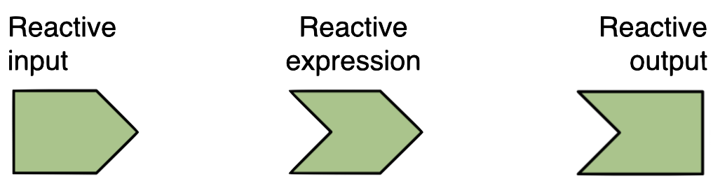
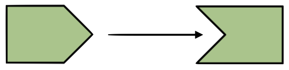
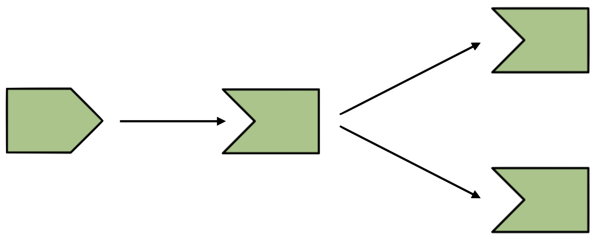
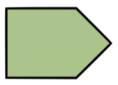
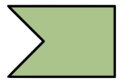
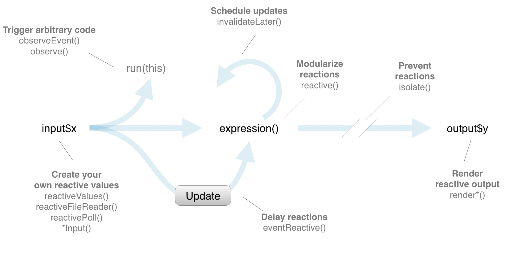
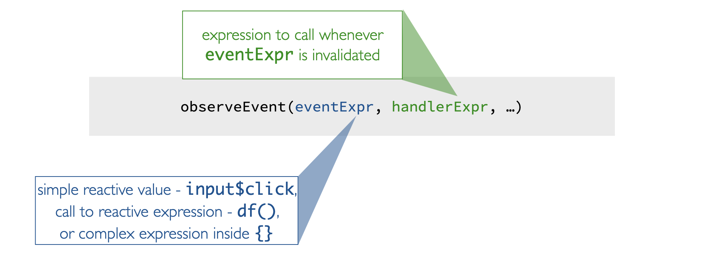

```{r setup, include=FALSE}
library(learnr)
library(shiny)
library(tidyverse)
library(usethis)
library(devtools)
library(rsconnect)

knitr::opts_chunk$set(
  echo = FALSE, 
  fig.align = "center",
  out.width = "80%"
  )
```

## 3.1 Reactive elements

### Reactive objects

In this section we discuss reactivity in a bit more detail. 

Three components of reactive execution in Shiny are

- reactive inputs,
- reactive expressions, and
- reactive outputs.

We're going to denote them with these symbols:

```{r image-input-expression-output, out.width = "60%"}

```

### Reactive inputs and outputs

```{r image-input-output, out.width = "40%"}

```

- A **reactive input** is a user input that comes through a browser interface, typically.
- A **reactive output** is something that appears in the user’s browser window, such as a plot or a table of values.
- One reactive input can be connected to multiple outputs, and vice versa. For example we might have a UI input widget for filtering out data based on user's selection, and the filtered data can be used in multiple outputs like plots and summaries.

### Reactive expressions

A **reactive expressions** is component between an input and an output.  
It can both be a dependent (i.e be a child) and have dependents (i.e. be a parent).

```{r image-input-expression-outputs, out.width = "40%"}

```

```{r mc-1, echo=FALSE}
question("Which of the following is false? Select all that apply.",
  answer("Reactive inputs can only be parents."),
  answer("Reactive inputs can only be children.", correct = TRUE),
  answer("Reactive expressions can be parents."),
  answer("Reactive expressions can be children."),
  answer("Reactive outputs can be parents.", correct = TRUE),
  answer("Reactive outputs can be children"),
  allow_retry = TRUE
)
```

###

To illustrate reactivity we're going to start with this app once again

```{r image-app-selectinput-scatterplot}
knitr::include_graphics("images/app-selectinput-scatterplot.png")
```

###

And end up with an app that...

* lets the user subset the data by movie type
* updates the plot for those selected movie types
* and display some text noting the number of movies in the selection

```{r image-app-scatterplot-text}
knitr::include_graphics("images/app-scatterplot-text.png")
```

The subsetted movies data frame gets used in two places, plot and text outputs. Hence, we we're going to make use of reactive expressions to build this app.

### 1. **ui:** Add a UI element for the user to select which movie type(s) of moves they want to plot with `selectInput()`.

```{r image-input, out.width = "10%", fig.align = "left"}

```

```{r snippet-selectInput, eval = FALSE, echo = TRUE}
# Select which types of movies to plot
selectInput(
  inputId = "selected_type",
  label = "Select movie type:",
  choices = levels(movies$title_type),
  selected = "Feature Film"
)
```

- We define an `inputId()` that we'll use to refer to the input element to later in the app 
- We come up with a user facing `label` 
- We specify the choices users can select from, 
- as well as a default choice

### 2. **server:** Filter for chosen title type and save the new data frame as a reactive expression.

Next, we filter for selected title type and save the new data frame as a reactive expression using the `reactive()` function.

```{r image-expression, out.width = "10%", fig.align = "left"}
knitr::include_graphics("images/expression.png")
```

```{r snippet-movies_subset, echo = TRUE, eval = FALSE}
# Create a subset of data filtering for chosen title types
movies_subset <- reactive({
  req(input$selected_type)
  filter(movies, title_type %in% input$selected_type)
})
```

This function creates a **cached expression** that knows it is out of date when its input changes. So you, the Shiny developer, do not need to worry about keeping track of when the input changes, Shiny automatically does that for you.

Two more things to note here:

1. Before we do any calculations that depends on `input$selected_type`, we check its availability with the `req()` function, and
2. We surround the expression with curly braces 

### 3. **server:** Use `movies_subset` (which is reactive) for plotting.

The next two steps could happen in either order. Let’s start with the plot first.

```{r image-output-1, out.width = "10%", fig.align = "left"}

```

```{r snippet-scatterplot, echo = TRUE, eval = FALSE}
# Create scatterplot
output$scatterplot <- renderPlot({
  ggplot(data = movies_subset(),aes_string(x = input$x, y = input$y)) +
    geom_point()
})
```

You should be familiar with creating plots using the `renderPlot()` function by now. But there is something new here. The data frame we're using is no longer movies, but the new reactive expression we created. And because it's reactive we refer to it with parentheses after its name. This is, once again, a cached expression, meaning that it will only rerun when its inputs change.

### 3. **ui** & **server:** Use movies_subset (which is reactive) for printing number of observations.

```{r image-output-2, out.width = "10%", fig.align = "left"}

```

And lastly we create the text stating the number of observations in the selection. The obvious choice for creating this output would be `renderText()`. But I feel like getting a little fancier with this one. Suppose we know a bit of HTML -- which is true, I really only know a bit of HTML -- and I want to use some text decoration, like bolding and line breaks in my text output. So we need a rendering function that generates HTML, which is `renderUI()`.

```{r snippet-uiOutput, echo = TRUE, eval = FALSE}
# ui - Lay out where text should appear on app
mainPanel( 
  ...
  # Print number of obs plotted
  uiOutput(outputId = "n"), 
  ...
)
```

```{r snippet-renderUI, echo = TRUE, eval = FALSE}
# server - Print number of movies plotted
output$n <- renderUI({
  HTML(paste0(
    "The plot displays the relationship between the <br>
              audience and critics' scores of <br>",
    nrow(movies_subset()),
    " <b>", input$selected_type, "</b> movies."
  ))
})
```

We use the `paste()` function to string along the text of the sentence we want displayed on the app. This sentence depends on the value of the number of rows of the `movies_subset` reactive expression we created earlier, as well as `input$selected` type. 

Using simple HTML we add some decoration to the text, and finally wrap the whole thing up in a function that marks the given text as HTML.

Then on the ui side, we use the counterpart `uiOutput()` function to lay out the text on the app.

### Practice - Add reactive data frame

We ended the previous chapter with an app that allows you to download a data file with selected variables from the `movies` dataset. We will now extend this app by adding a table output of the selected data as well. Given that the same dataset will be used in two outputs, it makes sense to make our code more efficient by using a reactive data frame.

Extend app by adding reactive data frame, which is a subset, that is used in the plot.

#### Your turn

- Define `movies_selected`: a reactive data frame consisting of selected variables (`input$selected_var`).
- Use the newly constructed `movies_selected` reactive data frame to avoid reconstructing the subsetted data frame multiple times throughout the app.

:::proj

*Complete the exercise by navigating to the RStudio Cloud Project titled __3-1 Add reactive data frame__ in your RStudio Workspace*

[<i class="fa fa-cloud"></i> Go to RStudio Cloud Project](https://rstudio.cloud/spaces/81721/join?access_code=I4VJaNsKfTqR3Td9hLP7E1nz8%2FtMg6Xbw9Bgqumv){.btn .test-drive}

:::

```{r ex-3-1-reactive, echo = TRUE, eval = FALSE}
# Load packages ----------------------------------------------------------------

library(shiny)
library(dplyr)
library(readr)

# Load data --------------------------------------------------------------------

load("movies.RData")

# Define UI --------------------------------------------------------------------

ui <- fluidPage(
  sidebarLayout(
    sidebarPanel(
      radioButtons(
        inputId = "filetype",
        label = "Select filetype:",
        choices = c("csv", "tsv"),
        selected = "csv"
      ),

      checkboxGroupInput(
        inputId = "selected_var",
        label = "Select variables:",
        choices = names(movies),
        selected = c("title")
      )
    ),

    mainPanel(
      dataTableOutput(outputId = "moviestable"),
      downloadButton("download_data", "Download data")
    )
  )
)

# Define server ----------------------------------------------------------------

server <- function(input, output, session) {
  
  # Create reactive data frame
  movies_selected <- ___
  
  # Create data table
  output$moviestable <- DT::renderDataTable({
    req(input$selected_var)
    datatable(
      data = movies %>% select(input$selected_var),
      options = list(pageLength = 10),
      rownames = FALSE
    )
  })
  
  # Download file
  output$download_data <- downloadHandler(
    filename = function() {
      paste0("movies.", input$filetype)
    },
    content = function(file) {
      if (input$filetype == "csv") {
        write_csv(movies %>% select(input$selected_var), file)
      }
      if (input$filetype == "tsv") {
        write_tsv(movies %>% select(input$selected_var), file)
      }
    }
  )
}

# Create the Shiny app object --------------------------------------------------

shinyApp(ui = ui, server = server)
```

<details>
<summary>Show solution</summary>

See the following code chunk for the solution to the exercise above. 

```{r ex-3-1-reactive-solution, echo = TRUE, eval = FALSE}
# Load packages ----------------------------------------------------------------

library(shiny)
library(dplyr)
library(readr)

# Load data --------------------------------------------------------------------

load("movies.RData")

# Define UI --------------------------------------------------------------------

ui <- fluidPage(
  sidebarLayout(
    sidebarPanel(
      radioButtons(
        inputId = "filetype",
        label = "Select filetype:",
        choices = c("csv", "tsv"),
        selected = "csv"
      ),

      checkboxGroupInput(
        inputId = "selected_var",
        label = "Select variables:",
        choices = names(movies),
        selected = c("title")
      )
    ),

    mainPanel(
      dataTableOutput(outputId = "moviestable"),
      downloadButton("download_data", "Download data")
    )
  )
)

# Define server ----------------------------------------------------------------

server <- function(input, output, session) {

  # Create reactive data frame
  movies_selected <- reactive({
    movies %>% select(input$selected_var)
  })

  # Create data table
  output$moviestable <- DT::renderDataTable({
    req(input$selected_var)
    datatable(
      data = movies_selected(),
      options = list(pageLength = 10),
      rownames = FALSE
    )
  })

  # Download file
  output$download_data <- downloadHandler(
    filename = function() {
      paste0("movies.", input$filetype)
    },
    content = function(file) {
      if (input$filetype == "csv") {
        write_csv(movies_selected(), file)
      }
      if (input$filetype == "tsv") {
        write_tsv(movies_selected(), file)
      }
    }
  )
}

# Create the Shiny app object --------------------------------------------------

shinyApp(ui = ui, server = server)
```
</details>


### Practice: Identify reactive objects

```{r mc-2, echo=FALSE}
question("The `movies_selected()` reactive expression from the previous exercise is a...",
  answer("Reactive input"),
  answer("Reactive expression", correct = TRUE),
  answer("Reactive output"),
  answer("Reactive paradigm"),
  allow_retry = TRUE,
  try_again = "Try again -- does it have children? Does it have parents? Does it have both?"
)
```

## 3.2 Using reactives

In this section we discuss why we use reactives.

### Why use reactives?

In the previous exercises we were able to reuse our subsetted data frame in multiple places in the server after defining it once as a reactive expression.

In general, reactive expressions help you avoid copy-and-paste code and let you not repeat yourself, and they also help decompose large and complex calculations into smaller pieces.

These benefits are similar to what happens when you decompose a large complex R script into a series of small functions that build on each other

### Functions vs. reactives 

While functions and reactives help accomplish similar goals in terms of not-repeating oneself, they're different in implementation. 

- Each time you call a function, R will evaluate it.

- However reactive expressions are lazy, they only get executed when their input changes. This means that even if you call a reactive expression multiple times in your app, it will only re-execute when its inputs change.

### Reactlog

Using many reactive expressions in your app can create a complicated dependency structure in your app.

The **reactlog** is a graphical representation of this dependency structure, and it also gives you very detailed information about what’s happening under the hood as Shiny evaluates your application.

To view the reactlog: 

- Start a fresh R session, and run `options(shiny.reactlog = TRUE)`
- Then launch your app as you normally would
- and in the app press `Ctrl + F3` (or on a Mac: `Cmd + F3`).

### 

The reactlog for the app we developed in the previous section looks like this. It uses the icons for reactive inputs, expressions, and outputs that we saw earlier in the course.

```{r image-reactlog}
knitr::include_graphics("images/reactlog.png")
```

* Outputs are at the end of the reactive flow.
* Inputs are at the beginning.  
* `movies_subset()` is a reactive expression in between the input and the outputs.

This visualization also makes it easy to view the inputs the reactive expression depends on and the output that depend on it.

### Practice - Find missing reactives

In the following app code there are a number of spots where reactives are not used properly.

#### Your turn

Debug the app, making sure reactives are being used correctly.

:::proj

*Complete the exercise by navigating to the RStudio Cloud Project titled __3-2a Find missing reactives__ in your RStudio Workspace*

[<i class="fa fa-cloud"></i> Go to RStudio Cloud Project](https://rstudio.cloud/spaces/81721/join?access_code=I4VJaNsKfTqR3Td9hLP7E1nz8%2FtMg6Xbw9Bgqumv){.btn .test-drive}

:::


```{r ex-3-2a-debug-reactives, eval = FALSE, echo = TRUE}
# Load packages ----------------------------------------------------------------

library(shiny)
library(ggplot2)
library(dplyr)
library(tools)

# Load data --------------------------------------------------------------------

load("movies.RData")

# Define UI --------------------------------------------------------------------

ui <- fluidPage(
  titlePanel("Movie browser"),

  sidebarLayout(
    sidebarPanel(
      selectInput(
        inputId = "y",
        label = "Y-axis:",
        choices = c(
          "IMDB rating" = "imdb_rating",
          "IMDB number of votes" = "imdb_num_votes",
          "Critics Score" = "critics_score",
          "Audience Score" = "audience_score",
          "Runtime" = "runtime"
        ),
        selected = "audience_score"
      ),

      selectInput(
        inputId = "x",
        label = "X-axis:",
        choices = c(
          "IMDB rating" = "imdb_rating",
          "IMDB number of votes" = "imdb_num_votes",
          "Critics Score" = "critics_score",
          "Audience Score" = "audience_score",
          "Runtime" = "runtime"
        ),
        selected = "critics_score"
      ),

      selectInput(
        inputId = "z",
        label = "Color by:",
        choices = c(
          "Title Type" = "title_type",
          "Genre" = "genre",
          "MPAA Rating" = "mpaa_rating",
          "Critics Rating" = "critics_rating",
          "Audience Rating" = "audience_rating"
        ),
        selected = "mpaa_rating"
      ),

      textInput(
        inputId = "plot_title",
        label = "Plot title",
        placeholder = "Enter text for plot title"
      ),

      checkboxGroupInput(
        inputId = "selected_type",
        label = "Select movie type(s):",
        choices = c("Documentary", "Feature Film", "TV Movie"),
        selected = "Feature Film"
      )
    ),

    mainPanel(
      plotOutput(outputId = "scatterplot"),
      textOutput(outputId = "description")
    )
  )
)

# Define server ----------------------------------------------------------------

server <- function(input, output, session) {

  # Create a subset of data filtering for selected title types
  movies_subset <- reactive({
    req(input$selected_type)
    filter(movies, title_type %in% input$selected_type)
  })

  # Convert plot_title toTitleCase
  output$pretty_plot_title <- toTitleCase(input$plot_title)

  # Create scatterplot object the plotOutput function is expecting
  output$scatterplot <- renderPlot({
    ggplot(
      data = movies_subset,
      aes_string(x = input$x, y = input$y, color = input$z)
    ) +
      geom_point() +
      labs(title = pretty_plot_title)
  })

  # Create descriptive text
  output$description <- renderText({
    paste0("The plot above titled '", pretty_plot_title, "' visualizes the relationship between ", input$x, " and ", input$y, ", conditional on ", input$z, ".")
  })
}

# Create the Shiny app object --------------------------------------------------

shinyApp(ui = ui, server = server)
```

<details>
<summary>Show solution</summary>

See the following code chunk for the solution to the exercise above. 

```{r ex-3-2a-debug-reactives-solution, echo = TRUE, eval = FALSE}
# Load packages ----------------------------------------------------------------

library(shiny)
library(ggplot2)
library(dplyr)
library(tools)

# Load data --------------------------------------------------------------------

load("movies.RData")

# Define UI --------------------------------------------------------------------

ui <- fluidPage(
  titlePanel("Movie browser"),

  sidebarLayout(
    sidebarPanel(
      selectInput(
        inputId = "y",
        label = "Y-axis:",
        choices = c(
          "IMDB rating" = "imdb_rating",
          "IMDB number of votes" = "imdb_num_votes",
          "Critics Score" = "critics_score",
          "Audience Score" = "audience_score",
          "Runtime" = "runtime"
        ),
        selected = "audience_score"
      ),

      selectInput(
        inputId = "x",
        label = "X-axis:",
        choices = c(
          "IMDB rating" = "imdb_rating",
          "IMDB number of votes" = "imdb_num_votes",
          "Critics Score" = "critics_score",
          "Audience Score" = "audience_score",
          "Runtime" = "runtime"
        ),
        selected = "critics_score"
      ),

      selectInput(
        inputId = "z",
        label = "Color by:",
        choices = c(
          "Title Type" = "title_type",
          "Genre" = "genre",
          "MPAA Rating" = "mpaa_rating",
          "Critics Rating" = "critics_rating",
          "Audience Rating" = "audience_rating"
        ),
        selected = "mpaa_rating"
      ),

      textInput(
        inputId = "plot_title",
        label = "Plot title",
        placeholder = "Enter text for plot title"
      ),

      checkboxGroupInput(
        inputId = "selected_type",
        label = "Select movie type(s):",
        choices = c("Documentary", "Feature Film", "TV Movie"),
        selected = "Feature Film"
      )
    ),

    mainPanel(
      plotOutput(outputId = "scatterplot"),
      textOutput(outputId = "description")
    )
  )
)

# Define server ----------------------------------------------------------------

server <- function(input, output, session) {

  # Create a subset of data filtering for selected title types
  movies_subset <- reactive({
    req(input$selected_type)
    filter(movies, title_type %in% input$selected_type)
  })

  # Convert plot_title toTitleCase
  pretty_plot_title <- reactive({
    toTitleCase(input$plot_title)
  })

  # Create scatterplot object the plotOutput function is expecting
  output$scatterplot <- renderPlot({
    ggplot(
      data = movies_subset(),
      aes_string(x = input$x, y = input$y, color = input$z)
    ) +
      geom_point() +
      labs(title = pretty_plot_title())
  })

  # Create descriptive text
  output$description <- renderText({
    paste0("The plot above titled '", pretty_plot_title(), "' visualizes the relationship between ", input$x, " and ", input$y, ", conditional on ", input$z, ".")
  })
}

# Create the Shiny app object --------------------------------------------------

shinyApp(ui = ui, server = server)
```

</details>

### Practice - Find inconsistencies in what the app is reporting

In this exercise we go on a hunt for mismatched used of reactives.

#### Your turn

- Run the sample code and view the app. Do the number of movies plotted match the number cited in the text below the app?
- If not, fix the app code.

:::proj

*Complete the exercise by navigating to the RStudio Cloud Project titled __3-2b Find inconsistencies in what the app is reporting__ in your RStudio Workspace*

[<i class="fa fa-cloud"></i> Go to RStudio Cloud Project](https://rstudio.cloud/spaces/81721/join?access_code=I4VJaNsKfTqR3Td9hLP7E1nz8%2FtMg6Xbw9Bgqumv){.btn .test-drive}

:::

```{r ex-3-2b-inconsistencies, eval = FALSE, echo = TRUE}
# Load packages ----------------------------------------------------------------

library(shiny)
library(ggplot2)
library(dplyr)

# Load data --------------------------------------------------------------------

load("movies.RData")

# Define UI --------------------------------------------------------------------

ui <- fluidPage(
  sidebarLayout(
    sidebarPanel(
      selectInput(
        inputId = "y",
        label = "Y-axis:",
        choices = c(
          "IMDB rating" = "imdb_rating",
          "IMDB number of votes" = "imdb_num_votes",
          "Critics Score" = "critics_score",
          "Audience Score" = "audience_score",
          "Runtime" = "runtime"
        ),
        selected = "audience_score"
      ),

      selectInput(
        inputId = "x",
        label = "X-axis:",
        choices = c(
          "IMDB rating" = "imdb_rating",
          "IMDB number of votes" = "imdb_num_votes",
          "Critics Score" = "critics_score",
          "Audience Score" = "audience_score",
          "Runtime" = "runtime"
        ),
        selected = "critics_score"
      ),

      selectInput(
        inputId = "z",
        label = "Color by:",
        choices = c(
          "Title Type" = "title_type",
          "Genre" = "genre",
          "MPAA Rating" = "mpaa_rating",
          "Critics Rating" = "critics_rating",
          "Audience Rating" = "audience_rating"
        ),
        selected = "mpaa_rating"
      ),

      checkboxGroupInput(
        inputId = "selected_type",
        label = "Select movie type(s):",
        choices = c("Documentary", "Feature Film", "TV Movie"),
        selected = "Feature Film"
      ),

      numericInput(
        inputId = "n_samp",
        label = "Sample size:",
        min = 1, max = nrow(movies),
        value = 3
      )
    ),

    mainPanel(
      plotOutput(outputId = "scatterplot"),
      uiOutput(outputId = "n")
    )
  )
)

# Define server ----------------------------------------------------------------

server <- function(input, output, session) {

  # Create a subset of data filtering for selected title types
  movies_subset <- reactive({
    req(input$selected_type)
    filter(movies, title_type %in% input$selected_type)
  })

  # Create new df that is n_samp obs from selected type movies
  movies_sample <- reactive({
    req(input$n_samp)
    sample_n(movies_subset(), input$n_samp)
  })

  # Create scatterplot object the plotOutput function is expecting
  output$scatterplot <- renderPlot({
    ggplot(data = movies_sample(), aes_string(x = input$x, y = input$y, color = input$z)) +
      geom_point()
  })

  # Print number of movies plotted
  output$n <- renderUI({
    types <- factor(movies_subset()$title_type, levels = input$selected_type)
    counts <- table(types)
    HTML(paste("There are", counts, input$selected_type, "movies plotted in the plot above. <br>"))
  })
}

# Create the Shiny app object --------------------------------------------------

shinyApp(ui = ui, server = server)
```

<details>
<summary>Show solution</summary>

See the following code chunk for the solution to the exercise above. 

```{r ex-3-2b-inconsistencies-solution, echo = TRUE, eval = FALSE}
# Load packages ----------------------------------------------------------------

library(shiny)
library(ggplot2)
library(dplyr)

# Load data --------------------------------------------------------------------

load("movies.RData")

# Define UI --------------------------------------------------------------------

ui <- fluidPage(
  sidebarLayout(
    sidebarPanel(
      selectInput(
        inputId = "y",
        label = "Y-axis:",
        choices = c(
          "IMDB rating" = "imdb_rating",
          "IMDB number of votes" = "imdb_num_votes",
          "Critics Score" = "critics_score",
          "Audience Score" = "audience_score",
          "Runtime" = "runtime"
        ),
        selected = "audience_score"
      ),

      selectInput(
        inputId = "x",
        label = "X-axis:",
        choices = c(
          "IMDB rating" = "imdb_rating",
          "IMDB number of votes" = "imdb_num_votes",
          "Critics Score" = "critics_score",
          "Audience Score" = "audience_score",
          "Runtime" = "runtime"
        ),
        selected = "critics_score"
      ),

      selectInput(
        inputId = "z",
        label = "Color by:",
        choices = c(
          "Title Type" = "title_type",
          "Genre" = "genre",
          "MPAA Rating" = "mpaa_rating",
          "Critics Rating" = "critics_rating",
          "Audience Rating" = "audience_rating"
        ),
        selected = "mpaa_rating"
      ),

      checkboxGroupInput(
        inputId = "selected_type",
        label = "Select movie type(s):",
        choices = c("Documentary", "Feature Film", "TV Movie"),
        selected = "Feature Film"
      ),

      numericInput(
        inputId = "n_samp",
        label = "Sample size:",
        min = 1, max = nrow(movies),
        value = 3
      )
    ),

    mainPanel(
      plotOutput(outputId = "scatterplot"),
      uiOutput(outputId = "n")
    )
  )
)

# Define server ----------------------------------------------------------------

server <- function(input, output, session) {

  # Create a subset of data filtering for selected title types
  movies_subset <- reactive({
    req(input$selected_type)
    filter(movies, title_type %in% input$selected_type)
  })

  # Create new df that is n_samp obs from selected type movies
  movies_sample <- reactive({
    req(input$n_samp)
    sample_n(movies_subset(), input$n_samp)
  })

  # Create scatterplot object the plotOutput function is expecting
  output$scatterplot <- renderPlot({
    ggplot(data = movies_sample(), aes_string(x = input$x, y = input$y, color = input$z)) +
      geom_point()
  })

  # Print number of movies plotted
  output$n <- renderUI({
    types <- movies_sample()$title_type %>%
      factor(levels = input$selected_type)
    counts <- table(types)
    HTML(paste("There are", counts, input$selected_type, "movies plotted in the plot above. <br>"))
  })
}

# Create the Shiny app object --------------------------------------------------

shinyApp(ui = ui, server = server)
```

</details>

## 3.3 Reactives and observers

In this section we discuss implementations of the three different types of reactive objects.

### Reactive flow

As we go through the different implementations, I recommend that you think back to where they appear on the reactive flow chart.

```{r image-rective-flow}

```

### Reactive inputs

An implementation of reactive inputs is `reactiveValues()`. 

One example is user inputs (`input$*`). The input object is a reactive value that looks like a list, and contains many individual reactive values that are set by input from the web browser.

### Reactive expressions

You can create reactive expressions with the `reactive()` function.

An example is the reactive data frame subsets we created in the earlier sections and exercises.

- Reactive expressions can access reactive values or other reactive expressions, and they return a value.

- They are useful for caching the results of any procedure that happens in response to user input.

### Implementation of reactive outputs

And lastly, the implementation for reactive outputs is observers.

For example, an `output$*` object is a reactive observer. Actually, under the hood a render function returns a reactive expression, and when you assign this reactive expression to an `output$*` value, Shiny automatically creates an observer that uses the reactive expression.

- Observers can access reactive inputs and reactive expressions, but they don’t return a value.

- Instead they are used for their **side effects**, which typically involves sending data to the web browser.

### Reactives vs. observers

To help these concepts sink in a bit more, let's compare reactives vs. observers.

#### Similarities

Both store expressions that can be executed

#### Differences

- Reactive expressions return values, but observers do not. 
- Observers eagerly respond to reactives, but reactive expressions do not.
- Reactive expressions must not have side effects, while observers are only useful for their side effects.

#### Most importantly

- We use the `reactive()` function when calculating values, without side effects.
- We use the `observe()` function when performing actions, with side effects.
- The moral of the story is to not use `observe()` when calculating a value, and to especially not use `reactive()` for performing actions with side effects.

### 

Here is a summary table of the differences between reactives and observers.

|              | `reactive()` | `observe()` |
|--------------|--------------|-------------|
| Purpose      | Calculations | Actions     |
| Side effects | Forbidden    | Allowed     |

A calculation is a block of code where you don’t care about whether the code actually executes—you just want the answer. Safe for caching. We use `reactive()` for these.

An action is where you care very much that the code executes, and there is no return value, there are only side effects. For these we use `observe()`.

### Practice - Reactives vs. observers

Next you get to assess your understanding of reactives vs. observers.  

You'll add a `reactiveValues()` element to the app. Define observers and their side effects, and how these compare to reactives.

#### Your turn

Using the code from the app you worked on in the last exercise, add another `reactiveValues()` and `reactiveVal()` element to the app.

:::proj

*Complete the exercise by building off of the code you completed in the last RStudio Cloud Project titled __3-2b Find inconsistencies in what the app is reporting__ in your RStudio Workspace*

[<i class="fa fa-cloud"></i> Go to RStudio Cloud Project](https://rstudio.cloud/spaces/81721/join?access_code=I4VJaNsKfTqR3Td9hLP7E1nz8%2FtMg6Xbw9Bgqumv){.btn .test-drive}

:::

## 3.4 Stop-trigger-delay

### 

In this section we present how to stop, trigger, and delay Shiny actions.

### Isolating reactions

Suppose your app has an input widget where users can enter text for the title of the plot. However you only want the title to update if any of the other inputs that go into the plot change. You can achieve this by isolating the plot title such that...

- When `input$x` or `input$y` changes, the plot, along with the title, will update.
- But when only the title input (`input$plot_title`) changes, the plot will **not** update.

```{r out.width = "100%"}
knitr::include_graphics("images/isolate.png")
```

### Triggering reactions

For triggering reactions, we use `observeEvent()`. So why might one want to explicitly trigger a reaction? 

Sometimes you might want to wait for a specific action to be taken from the user, like clicking an action button, before calculating an expression or taking an action. A reactive value or expression that is used to trigger other calculations in this way is called an **event**. 

```{r out.width = "100%"}

```

- These events can be the first argument in the `observeEvent()` function. This argument can be a simple reactive value like an input, a call to a reactive expression, or a complex expression provided wrapped in curly braces.

- The second argument is the expression to call whenever the first argument is invalidated.

So what you see here is similar to saying "if event expression happens, call handler expression".

###

Suppose your app allows for taking a random sample of the data based on a sample size numeric input. Suppose also that you want to add functionality for the users to download the random sample they generated *if* they press an action button (`actionButton()`) requesting to do so. 

```{r out.width = "100%"}
knitr::include_graphics("images/actionButton.png")
```

- In the UI, we create an action button.
- And in the server, we condition the `observeEvent()` on the `inputId` of that action button. This way R knows to call the expression given in the second argument of `observeEvent()` when the user presses the action button.

### Delaying reactions

And finally we can delay reactions with `eventReactive()`, which takes similar arguments as `observeEvent()`.

```{r out.width = "100%"}
knitr::include_graphics("images/eventReactive.png")
```

###

Suppose your goal is to change how users take random samples in your app -- you only want them to get a new sample when an action button that says "get new sample" is pressed, not when other things like a numeric input defining the size of the sample changes.

```{r out.width = "100%"}
knitr::include_graphics("images/eventReactive-ignoreNULL.png")
```

- In the `eventReactive()` function, the first argument is the input associated with the action button, and the second argument is the sampling code.
- Then, we add one more argument -- `ignoreNull`. This argument tells R what to do (or what not to do) when the event expression evaluates to `Null`. For example, what should the app do when the app is first launched and the user has not even interacted with the app yet? If this is set to `FALSE`, the app will initially perform the action or calculation and then the user can re-initiate it.

### `observeEvent()` vs `eventReactive()`

`observeEvent()` and `eventReactive()` look and feel very similar -- same syntax, same arguments, but they're actually not the same at all!

- `observeEvent()` is used to perform an action in response to an event
- `eventReactive()` is used to create a calculated value that only updates in response to an event

### `observeEvent()`/`eventReactive()` vs. `observe()`/`reactive()`

This pair of functions also seem similar, at a first glance, to the observe/reactive pair, however the main difference between them is that

- `observe()` and `reactive()` functions automatically trigger on whatever they access
- `observeEvent()` and `eventReactive()` functions need to be explicitly told what triggers them

### `isolate()` vs event handling functions

And where does isolate fit in all this?

- `isolate()` is used to stop a reaction
- `observeEvent()` is used to perform an action in response to an event
- `eventReactive()` is used to create a calculated value that only updates in response to an event

### Practice - Stop with `isolate()`

In the following app, the user, in addition to controlling which variables are plotted, can adjust the size and transparency of points and define the plot title.

#### Your turn

- Run the code and test out the functionality of the plot title input. Is the plot title updated immediately after you're done typing the title?
- Modify the app so that the plot title *only* gets updated when one of the other inputs is changed.

:::proj

*Complete the exercise by navigating to the RStudio Cloud Project titled __3-4a Stop with isolate()__ in your RStudio Workspace*

[<i class="fa fa-cloud"></i> Go to RStudio Cloud Project](https://rstudio.cloud/spaces/81721/join?access_code=I4VJaNsKfTqR3Td9hLP7E1nz8%2FtMg6Xbw9Bgqumv){.btn .test-drive}

:::

```{r ex-3-4a-isolate, eval = FALSE, echo = TRUE}
# Load packages ----------------------------------------------------------------

library(shiny)
library(ggplot2)
library(tools)

# Load data --------------------------------------------------------------------

load("movies.RData")

# Define UI --------------------------------------------------------------------

ui <- fluidPage(
  sidebarLayout(
    sidebarPanel(
      selectInput(
        inputId = "y",
        label = "Y-axis:",
        choices = c(
          "IMDB rating" = "imdb_rating",
          "IMDB number of votes" = "imdb_num_votes",
          "Critics Score" = "critics_score",
          "Audience Score" = "audience_score",
          "Runtime" = "runtime"
        ),
        selected = "audience_score"
      ),

      selectInput(
        inputId = "x",
        label = "X-axis:",
        choices = c(
          "IMDB rating" = "imdb_rating",
          "IMDB number of votes" = "imdb_num_votes",
          "Critics Score" = "critics_score",
          "Audience Score" = "audience_score",
          "Runtime" = "runtime"
        ),
        selected = "critics_score"
      ),

      selectInput(
        inputId = "z",
        label = "Color by:",
        choices = c(
          "Title Type" = "title_type",
          "Genre" = "genre",
          "MPAA Rating" = "mpaa_rating",
          "Critics Rating" = "critics_rating",
          "Audience Rating" = "audience_rating"
        ),
        selected = "mpaa_rating"
      ),

      sliderInput(
        inputId = "alpha",
        label = "Alpha:",
        min = 0, max = 1,
        value = 0.5
      ),

      sliderInput(
        inputId = "size",
        label = "Size:",
        min = 0, max = 5,
        value = 2
      ),

      textInput(
        inputId = "plot_title",
        label = "Plot title",
        placeholder = "Enter text to be used as plot title"
      )
    ),

    mainPanel(
      plotOutput(outputId = "scatterplot")
    )
  )
)

# Define server ----------------------------------------------------------------

server <- function(input, output, session) {
  output$scatterplot <- renderPlot({
    ggplot(data = movies, aes_string(x = input$x, y = input$y, color = input$z)) +
      geom_point(alpha = input$alpha, size = input$size) +
      labs(title = toTitleCase(input$plot_title))
  })
}

# Create the Shiny app object --------------------------------------------------

shinyApp(ui = ui, server = server)
```

<details>
<summary>Show solution</summary>

See the following code chunk for the solution to the exercise above. 

```{r ex-3-4a-isolate-solution, echo = TRUE, eval = FALSE}
# Load packages ----------------------------------------------------------------

library(shiny)
library(ggplot2)
library(tools)

# Load data --------------------------------------------------------------------

load("movies.RData")

# Define UI --------------------------------------------------------------------

ui <- fluidPage(
  sidebarLayout(
    sidebarPanel(
      selectInput(
        inputId = "y",
        label = "Y-axis:",
        choices = c(
          "IMDB rating" = "imdb_rating",
          "IMDB number of votes" = "imdb_num_votes",
          "Critics Score" = "critics_score",
          "Audience Score" = "audience_score",
          "Runtime" = "runtime"
        ),
        selected = "audience_score"
      ),

      selectInput(
        inputId = "x",
        label = "X-axis:",
        choices = c(
          "IMDB rating" = "imdb_rating",
          "IMDB number of votes" = "imdb_num_votes",
          "Critics Score" = "critics_score",
          "Audience Score" = "audience_score",
          "Runtime" = "runtime"
        ),
        selected = "critics_score"
      ),

      selectInput(
        inputId = "z",
        label = "Color by:",
        choices = c(
          "Title Type" = "title_type",
          "Genre" = "genre",
          "MPAA Rating" = "mpaa_rating",
          "Critics Rating" = "critics_rating",
          "Audience Rating" = "audience_rating"
        ),
        selected = "mpaa_rating"
      ),

      sliderInput(
        inputId = "alpha",
        label = "Alpha:",
        min = 0, max = 1,
        value = 0.5
      ),

      sliderInput(
        inputId = "size",
        label = "Size:",
        min = 0, max = 5,
        value = 2
      ),

      textInput(
        inputId = "plot_title",
        label = "Plot title",
        placeholder = "Enter text to be used as plot title"
      )
    ),

    mainPanel(
      plotOutput(outputId = "scatterplot")
    )
  )
)

# Define server ----------------------------------------------------------------

server <- function(input, output, session) {
  output$scatterplot <- renderPlot({
    ggplot(data = movies, aes_string(x = input$x, y = input$y, color = input$z)) +
      geom_point(alpha = input$alpha, size = input$size) +
      labs(title = isolate({
        toTitleCase(input$plot_title)
      }))
  })
}

# Create the Shiny app object --------------------------------------------------

shinyApp(ui = ui, server = server)
```

</details>

### Practice - Delay with `eventReactive()`

The following app has the same starter code as the previous exercise.

#### Your turn

Modify the app such that the title is updated only when a button titled "Update plot title" is clicked.

:::proj

*Complete the exercise by navigating to the RStudio Cloud Project titled __3-4b Delay with eventReactive()__ in your RStudio Workspace*

[<i class="fa fa-cloud"></i> Go to RStudio Cloud Project](https://rstudio.cloud/spaces/81721/join?access_code=I4VJaNsKfTqR3Td9hLP7E1nz8%2FtMg6Xbw9Bgqumv){.btn .test-drive}

:::

```{r ex-3-4b-eventReactive, eval = FALSE, echo = TRUE}
# Load packages ----------------------------------------------------------------

library(shiny)
library(ggplot2)
library(tools)

# Load data --------------------------------------------------------------------

load("movies.RData")

# Define UI --------------------------------------------------------------------

ui <- fluidPage(
  sidebarLayout(
    sidebarPanel(
      selectInput(
        inputId = "y",
        label = "Y-axis:",
        choices = c(
          "IMDB rating" = "imdb_rating",
          "IMDB number of votes" = "imdb_num_votes",
          "Critics Score" = "critics_score",
          "Audience Score" = "audience_score",
          "Runtime" = "runtime"
        ),
        selected = "audience_score"
      ),

      selectInput(
        inputId = "x",
        label = "X-axis:",
        choices = c(
          "IMDB rating" = "imdb_rating",
          "IMDB number of votes" = "imdb_num_votes",
          "Critics Score" = "critics_score",
          "Audience Score" = "audience_score",
          "Runtime" = "runtime"
        ),
        selected = "critics_score"
      ),

      selectInput(
        inputId = "z",
        label = "Color by:",
        choices = c(
          "Title Type" = "title_type",
          "Genre" = "genre",
          "MPAA Rating" = "mpaa_rating",
          "Critics Rating" = "critics_rating",
          "Audience Rating" = "audience_rating"
        ),
        selected = "mpaa_rating"
      ),

      sliderInput(
        inputId = "alpha",
        label = "Alpha:",
        min = 0, max = 1,
        value = 0.5
      ),

      sliderInput(
        inputId = "size",
        label = "Size:",
        min = 0, max = 5,
        value = 2
      ),

      textInput(
        inputId = "plot_title",
        label = "Plot title",
        placeholder = "Enter text to be used as plot title"
      )
    ),

    mainPanel(
      plotOutput(outputId = "scatterplot")
    )
  )
)

# Define server ----------------------------------------------------------------

server <- function(input, output, session) {
  output$scatterplot <- renderPlot({
    ggplot(data = movies, aes_string(x = input$x, y = input$y, color = input$z)) +
      geom_point(alpha = input$alpha, size = input$size) +
      labs(title = toTitleCase(input$plot_title))
  })
}

# Create the Shiny app object --------------------------------------------------

shinyApp(ui = ui, server = server)
```

<details>
<summary>Show solution</summary>

See the following code chunk for the solution to the exercise above. 

```{r ex-3-4b-eventReactive-solution, echo = TRUE, eval = FALSE}
# Load packages ----------------------------------------------------------------

library(shiny)
library(ggplot2)
library(tools)

# Load data --------------------------------------------------------------------

load("movies.RData")

# Define UI --------------------------------------------------------------------

ui <- fluidPage(
  sidebarLayout(
    sidebarPanel(
      selectInput(
        inputId = "y",
        label = "Y-axis:",
        choices = c(
          "IMDB rating" = "imdb_rating",
          "IMDB number of votes" = "imdb_num_votes",
          "Critics Score" = "critics_score",
          "Audience Score" = "audience_score",
          "Runtime" = "runtime"
        ),
        selected = "audience_score"
      ),

      selectInput(
        inputId = "x",
        label = "X-axis:",
        choices = c(
          "IMDB rating" = "imdb_rating",
          "IMDB number of votes" = "imdb_num_votes",
          "Critics Score" = "critics_score",
          "Audience Score" = "audience_score",
          "Runtime" = "runtime"
        ),
        selected = "critics_score"
      ),

      selectInput(
        inputId = "z",
        label = "Color by:",
        choices = c(
          "Title Type" = "title_type",
          "Genre" = "genre",
          "MPAA Rating" = "mpaa_rating",
          "Critics Rating" = "critics_rating",
          "Audience Rating" = "audience_rating"
        ),
        selected = "mpaa_rating"
      ),

      sliderInput(
        inputId = "alpha",
        label = "Alpha:",
        min = 0, max = 1,
        value = 0.5
      ),

      sliderInput(
        inputId = "size",
        label = "Size:",
        min = 0, max = 5,
        value = 2
      ),

      textInput(
        inputId = "plot_title",
        label = "Plot title",
        placeholder = "Enter text to be used as plot title"
      ),

      actionButton(
        inputId = "update_plot_title",
        label = "Update plot title"
      )
    ),

    mainPanel(
      plotOutput(outputId = "scatterplot")
    )
  )
)

# Define server ----------------------------------------------------------------

server <- function(input, output, session) {
  new_plot_title <- eventReactive(
    eventExpr = input$update_plot_title,
    valueExpr = {
      toTitleCase(input$plot_title)
    }
  )

  output$scatterplot <- renderPlot({
    ggplot(data = movies, aes_string(x = input$x, y = input$y, color = input$z)) +
      geom_point(alpha = input$alpha, size = input$size) +
      labs(title = new_plot_title())
  })
}

# Create the Shiny app object --------------------------------------------------

shinyApp(ui = ui, server = server)
```

</details>

### Practice - Trigger with `observeEvent()`

In this app we want two things to happen when an action button is clicked: 

1. A message printed to the console stating how many records are shown and
1. A table output of those records.

#### Your turn

- Fill in the necessary function and input ID for printing a message to the console when the action button is clicked.
- Set up a table output that will print only when action button is clicked, but not when other inputs that go into the creation of that output changes.

:::proj

*Complete the exercise by navigating to the RStudio Cloud Project titled __3-4c Trigger with observeEvent()__ in your RStudio Workspace*

[<i class="fa fa-cloud"></i> Go to RStudio Cloud Project](https://rstudio.cloud/spaces/81721/join?access_code=I4VJaNsKfTqR3Td9hLP7E1nz8%2FtMg6Xbw9Bgqumv){.btn .test-drive}

:::

```{r ex-3-4c-trigger, eval = FALSE, echo = TRUE}
# Load packages ----------------------------------------------------------------

library(shiny)

# Load data --------------------------------------------------------------------

load("movies.RData")

# Define UI --------------------------------------------------------------------

ui <- fluidPage(
  sidebarLayout(
    sidebarPanel(
      numericInput(
        inputId = "n_rows",
        label = "How many rows do you want to see?",
        value = 10
      ),

      actionButton(
        inputId = "button",
        label = "Show"
      )
    ),

    mainPanel(
      tableOutput(outputId = "datatable")
    )
  )
)

# Define server ----------------------------------------------------------------

server <- function(input, output, session) {

  # Print a message to the console every time button is pressed;
  ___(input$___, {
    cat("Showing", input$n_rows, "rows\n")
  })
  
  # Take a reactive dependency on input$button, but not on any other inputs
  df <- ___(input$___, {
    head(movies, input$n_rows)
  })
  output$___ <- ___({
    df()
  })
  
}

# Create the Shiny app object --------------------------------------------------

shinyApp(ui = ui, server = server)
```

<details>
<summary>Show solution</summary>

See the following code chunk for the solution to the exercise above. 

```{r ex-3-4c-trigger-solution, echo = TRUE, eval = FALSE}
# Load packages ----------------------------------------------------------------

library(shiny)

# Load data --------------------------------------------------------------------

load("movies.RData")

# Define UI --------------------------------------------------------------------

ui <- fluidPage(
  sidebarLayout(
    sidebarPanel(
      numericInput(
        inputId = "n_rows",
        label = "How many rows do you want to see?",
        value = 10
      ),

      actionButton(
        inputId = "button",
        label = "Show"
      )
    ),

    mainPanel(
      tableOutput(outputId = "datatable")
    )
  )
)

# Define server ----------------------------------------------------------------

server <- function(input, output, session) {

  # Pring a message to the console every time button is pressed;
  observeEvent(input$button, {
    cat("Showing", input$n_rows, "rows\n")
  })

  # Take a reactive dependency on input$button,
  # but not on any of the stuff inside the function
  df <- eventReactive(input$button, {
    head(movies, input$n_rows)
  })
  output$datatable <- renderTable({
    df()
  })
}

# Create the Shiny app object --------------------------------------------------

shinyApp(ui = ui, server = server)
```

</details>

### Practice - Difference between `eventReactive()` and `observeEvent()`

```{r mc-3, echo=FALSE}
question("Which of the following is false?",
  answer("`observeEvent()` is used to perform an action in response to an event"),
  answer("`isolate()` is used to trigger a reaction", correct = TRUE),
  answer("`eventReactive()` is used to create a calculated value that only updates in response to an event"),
  answer("Recalculating a value does not generally count as performing an action"),
  allow_retry = TRUE
)
```

## 3.5 Reactive Recap

### 

Let's recap what we have learned about reactivity and discuss best practices.

### Three Lessons

There are three main takeaway messages about reactivity that all Shiny developers should be familiar with.

1. Reactives are like functions, but they are lazily evaluated, meaning they will only evaluate when their inputs change, not each time they are called.
1. Reactive inputs and expressions are for their values and observers are for their side effects. 
1. Do not define a `reactive()` inside a `render*()` function.

### What's wrong? 

We'll wrap up the chapter with a simple but important example.

Here we have an app that adds 2 to the current value of x.

```{r add-2-1, eval = FALSE, echo = TRUE}
library(shiny)

ui <- fluidPage(
  titlePanel("Add 2"),
  sidebarLayout(
    sidebarPanel(
      sliderInput("x", "Select x", min = 1, max = 50, value = 30)
    ),
    mainPanel(textOutput("x_updated"))
  )
)

server <- function(input, output, session) {
  add_2 <- function(x) {
    x + 2
  }
  current_x <- add_2(input$x)
  output$x_updated <- renderText({
    current_x
  })
}

shinyApp(ui, server)
```

### 

Here is what the app should look like:

```{r out.width = "50%"}
knitr::include_graphics("images/add-2.png")
```

### 

And here again is the code. What's wrong here? 

```{r add-2-2, eval = FALSE, echo = TRUE}
library(shiny)

ui <- fluidPage(
  titlePanel("Add 2"),
  sidebarLayout(
    sidebarPanel(
      sliderInput("x", "Select x", min = 1, max = 50, value = 30)
    ),
    mainPanel(textOutput("x_updated"))
  )
)

server <- function(input, output, session) {
  add_2 <- function(x) {
    x + 2
  }
  current_x <- add_2(input$x)
  output$x_updated <- renderText({
    current_x
  })
}

shinyApp(ui, server)
```

###

The object `current_x` is used in the render function, but it's not currently a reactive expression.

###

So we need to put the definition of `current_x` in the reactive function, like this:

```{r add-2-3, eval = FALSE, echo = TRUE}
library(shiny)

ui <- fluidPage(
  titlePanel("Add 2"),
  sidebarLayout(
    sidebarPanel(sliderInput("x", "Select x", min = 1, max = 50, value = 30)),
    mainPanel(textOutput("x_updated"))
  )
)

server <- function(input, output, session) {
  add_2 <- function(x) {
    x + 2
  }
  current_x <- reactive({
    add_2(input$x)
  })
  output$x_updated <- renderText({
    current_x
  })
}

shinyApp(ui, server)
```

But that's still not enough...

###

We also need to refer to `current_x` with parantheses after its name. 

```{r add-2-4, eval = FALSE, echo = TRUE}
library(shiny)

ui <- fluidPage(
  titlePanel("Add 2"),
  sidebarLayout(
    sidebarPanel(sliderInput("x", "Select x", min = 1, max = 50, value = 30)),
    mainPanel(textOutput("x_updated"))
  )
)

server <- function(input, output, session) {
  add_2 <- function(x) {
    x + 2
  }
  current_x <- reactive({
    add_2(input$x)
  })
  output$x_updated <- renderText({
    current_x()
  })
}

shinyApp(ui, server)
```

Missing the parentheses is a common error when working with reactives. So add this to your list! When developing Shiny apps, be wary of missing commas, and of missing parentheses when calling reactive expressions.

### Practice - What's wrong?

#### Your turn

What's wrong with this? Fix it.

:::proj

*Complete the exercise by navigating to the RStudio Cloud Project titled __3-5 Whats wrong__ in your RStudio Workspace*

[<i class="fa fa-cloud"></i> Go to RStudio Cloud Project](https://rstudio.cloud/spaces/81721/join?access_code=I4VJaNsKfTqR3Td9hLP7E1nz8%2FtMg6Xbw9Bgqumv){.btn .test-drive}

:::

```{r ex-3-5-mult3, echo = TRUE, eval = FALSE}
# Load packages ----------------------------------------------------------------

library(shiny)

# Define UI --------------------------------------------------------------------

ui <- fluidPage(
  titlePanel("Multiply by 3"),
  sidebarLayout(
    sidebarPanel(sliderInput("x", "Select x", min = 1, max = 50, value = 30)),
    mainPanel(textOutput("x_updated"))
  )
)

# Define server ----------------------------------------------------------------

server <- function(input, output, session) {
  
  mult_3 <- function(x) {
    x * 3
  }
  output$x_updated <- mult_3(input$x)
  
}

# Create the Shiny app ---------------------------------------------------------
shinyApp(ui, server)
```

<details>
<summary>Show solution</summary>

See the following code chunk for the solution to the exercise above. 

```{r ex-3-5-mult3-solution, echo = TRUE, eval = FALSE}
# Load packages ----------------------------------------------------------------

library(shiny)

# Define UI --------------------------------------------------------------------

ui <- fluidPage(
  titlePanel("Multiply by 3"),
  sidebarLayout(
    sidebarPanel(sliderInput("x", "Select x", min = 1, max = 50, value = 30)),
    mainPanel(textOutput("x_updated"))
  )
)

# Define server ----------------------------------------------------------------

server <- function(input, output, session) {
  mult_3 <- function(x) {
    x * 3
  }
  current_x <- reactive({
    mult_3(input$x)
  })
  output$x_updated <- renderText({
    current_x()
  })
}

# Create the Shiny app ---------------------------------------------------------
shinyApp(ui = ui, server = server)
```

</details>
