```{r setup, include=FALSE}
library(learnr)
library(shiny)
library(tidyverse)
library(usethis)
library(devtools)
library(rsconnect)

knitr::opts_chunk$set(
  echo = FALSE, 
  fig.align = "center",
  out.width = "100%"
  )
```


## 1.1 Welcome

### 

This tutorial comprised of four modules will introduce you to Shiny, the R package for building interactive web apps straight from R.

In this module, we'll begin by introducing the basics of Shiny.

So, let's get to it...

### Here is a Shiny app

And not just any app, an app that you will be able to build by the end of this tutorial!

```{r, context = "data", cache = TRUE}
load("movies.RData")
```

```{r}
knitr::include_app("https://minecr.shinyapps.io/movies/", height = "1200px")
```

### 

We'll go through the technical details of each component of such an app throughout the tutorial, but for now let's take a high level view.

```{r}
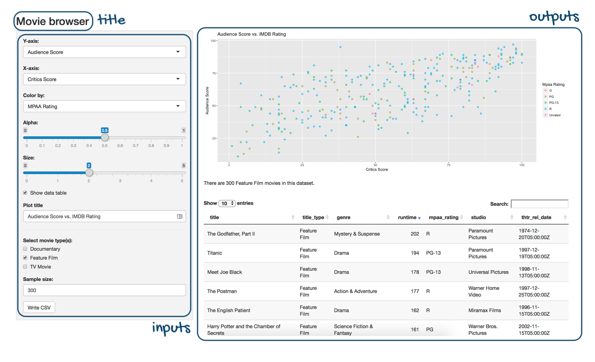
```

We have: 

- a title for the app,
- a series of inputs:
  - some of these inputs use drop down menus for selection,
  - some are sliders,
  - some allow for text input, and
  - some are action buttons
- and a few outputs:
  - a plot output that the user can interactively update,
  - a text output that updates alongside it, and
  - a data table output that also updates alongside these.

As much as it looks like there is a lot going on in this sample app, the app doesn't even scratch the surface of what you can build with Shiny. 

I hope you're excited to take it all in!

### Background

Before we get started with Shiny, let's talk background...  

This tutorial assumes that you are familiar with R as a programming language.

Additionally, this tutorial uses packages from the [tidyverse](https://tidyverse.org/) (e.g. [**dplyr**](https://dplyr.tidyverse.org/) for data wrangling and [**ggplot2**](https://ggplot2.tidyverse.org/) for data visualisation). Your Shiny apps can use any package, but if you'd like to learn more about doing data science with the tidyverse, see [here](https://www.tidyverse.org/learn/).

### Help

The tutorial is designed for beginners and many of the exercises have plenty of scaffolding to help you along the way. 

That being said, there are a few other resources that might help your learning.

```{r, out.width = "80%"}
knitr::include_graphics("images/help.png")
```

1. The first is the [**Shiny cheatsheet**](https://github.com/rstudio/cheatsheets/raw/master/shiny.pdf). This is a handy-dandy [cheatsheet](https://rstudio.com/resources/cheatsheets/) that I recommend you keep close by when building Shiny apps.

1. The second is the [**Shiny homepage**](https://shiny.rstudio.com). It is *the* place to learn about all things Shiny and to keep up to date with it as it evolves.

### Tips 

Also, let's go over three very important tips for learning to develop Shiny apps:

1. Always **run the entire script** containing the R code, not just up to the point where you’re developing code. For most exercises in this tutorial you will be asked to modify or update existing Shiny code, and even though you might be altering a small portion of the code, you still need to run the entire app code to create the app.

1. Sometimes the best way to troubleshoot is to **run the app and review the error**. Not only can the error message be informative, but googling the error message might quickly land you on a solution.

1. **Watch out for commas!** This will mean more as you start to learn Shiny, but just keep in mind, a Shiny error can often be caused by a missing comma. Thankfully, the RStudio IDE will alert you to most of these missing comma or similar syntax errors, like the one shown below.

```{r, out.width = "30%"}
knitr::include_graphics("images/missing-comma-ide.png")
```

### Anatomy of a Shiny app

Alrighty, let's take a look at the anatomy of a Shiny app:

```{r, out.width = "80%"}
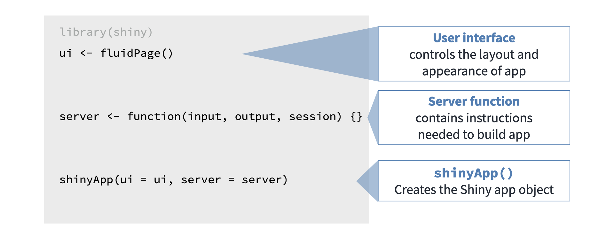
```

- We start by loading any necessary packages, one of which is necessarily shiny.

- Then we lay out the user interface with a ui object that controls the appearance of our app.

- And we define the server function that contains instructions needed to build the app.

- We end each Shiny app script with a call to the shinyApp() function that puts these two components together to create the Shiny app object.

### Data

In this tutorial we will build a simple movie browser app.

We will use data from the movies dataset, which combines data from two websites: the Internet Movie Database, commonly known as IMDB, and Rotten Tomatoes. The observations are a random sample of 651 movies released in the US between 1970 and 2014.

So where does the loading of the data happen in an app?

### Revisit

Let's revisit the app layout from a couple sections back.

```{r, out.width = "80%"}
knitr::include_graphics("images/revisit.png")
```

We load the data before `ui` and `server` definitions so that it can be used in both.

Alright, time for some practice!

### Practice: What's in an app?

```{r mc-1}
question("Which is not generally a part of the Shiny app architecture?",
  answer("A function that installs an R package",
    correct = TRUE,
    message = "You don't want to reinstall the package every time you run your app, so you should do this once in your console instead of within your Shiny app."
  ),
  answer("User interface"),
  answer("Server function"),
  answer("A function that creates Shiny app objects"),
  allow_retry = FALSE,
  random_answer_order = TRUE
)
```

### First peek under the hood

Below you can see the complete code to reproduce the app we introduced in the previous section. Now you get to interact with the app yourself, and make small adjustments to it. 

I've created an RStudio Cloud Project for you to test drive this code. Click the button below to be taken to your RStudio Workspace, select **1.1 First peek under the hood** from the Project list, and follow the exercise instructions below to get started!

:::proj

*Navigate to the project called __1-1 First peek under the hood__ after clicking the button below*

[<i class="fa fa-cloud"></i> Go to RStudio Cloud Workspace](https://rstudio.cloud/spaces/81721/join?access_code=I4VJaNsKfTqR3Td9hLP7E1nz8%2FtMg6Xbw9Bgqumv){.btn .test-drive}

:::


#### Your turn

- Once your RStudio Cloud Project is open to the script `app.R`, click 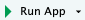 to run the code and generate the app.
- Play with the input sliders and observe how the output changes.
- Change the `selected` choice for the `y` input to `imdb_rating` and for the `x` input to `imdb_num_votes` and rerun the app.

```{r ex-1-1-slider, eval = FALSE, echo = TRUE}
# Load packages ----------------------------------------------------------------

library(shiny)
library(ggplot2)

# Load data --------------------------------------------------------------------

load("movies.RData")

# Define UI --------------------------------------------------------------------

ui <- fluidPage(

  sidebarLayout(

    # Inputs: Select variables to plot
    sidebarPanel(

      # Select variable for y-axis
      selectInput(
        inputId = "y",
        label = "Y-axis:",
        choices = c("imdb_rating", "imdb_num_votes", "critics_score", "audience_score", "runtime"),
        selected = "audience_score"
      ),
      # Select variable for x-axis
      selectInput(
        inputId = "x",
        label = "X-axis:",
        choices = c("imdb_rating", "imdb_num_votes", "critics_score", "audience_score", "runtime"),
        selected = "critics_score"
      )
    ),

    # Output: Show scatterplot
    mainPanel(
      plotOutput(outputId = "scatterplot")
    )
  )
)

# Define server ----------------------------------------------------------------

server <- function(input, output, session) {
  output$scatterplot <- renderPlot({
    ggplot(data = movies, aes_string(x = input$x, y = input$y)) +
      geom_point()
  })
}

# Create a Shiny app object ----------------------------------------------------

shinyApp(ui = ui, server = server)
```

## 1.2 User interface (UI)

### 

In this section we'll build the user interface of a simple app.

However, before we get into the weeds of building a user interface, let's revisit the anatomy of a Shiny app.

```{r}
knitr::include_graphics("images/app-selectinput-scatterplot.png")
```

- The user interface, that we'll refer to as the "UI" going forward, defines and lays out the inputs of your app where users can make their selections. It also lays out the outputs.

- The server function, on the other hand, calculates outputs and performs any other calculations needed for the outputs.

### Example

```{r}
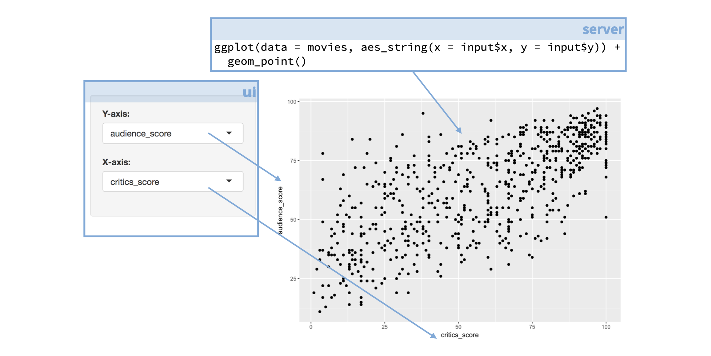
```

For example, if your app features a plot the code for building that plot lives in the server function. But the setup for the user defined inputs for the plot, as well as information on where physically on the app the plot should appear, are defined in the UI. 

###

Here is the app we'll work with in this section and the code that builds the UI of that app.

Since this is too much code to parse, we’ll explore individual components of the UI one by one.


```{r}
knitr::include_graphics("images/app-selectinput-scatterplot.png")
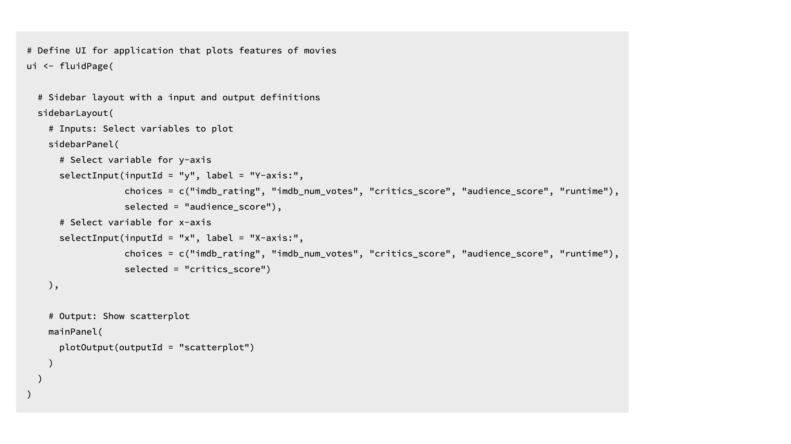
```

### `fluidPage()`

At the outermost layer of our UI definition we begin with the `fluidPage()` function.

```{r}
knitr::include_graphics("images/fluidPage.png")
```

The `fluidPage()` function creates a fluid page layout consisting of rows and columns. Rows make sure that elements in them appear on the same line. Columns within these rows define how much horizontal space each element should occupy. 

Fluid pages scale their components in realtime to fill all available browser width, which means you, the app developer, don’t need to worry about defining relative widths for individual app components. 

As always, for more information on arguments to this function, you can view the R function help by typing `?fluidPage` in your R console or visiting the function reference page on the package website [here](https://shiny.rstudio.com/reference/shiny/latest/).

### Layout

Next, we define the layout of our app with `sidebarLayout()`.

```{r}
knitr::include_graphics("images/layout.png")
```

Shiny includes a number of options for laying out the components of an application. The default layout, the one we're using in our example app, is a layout with a sidebar, that you can define with the `sidebarLayout()` function. 

```{r}
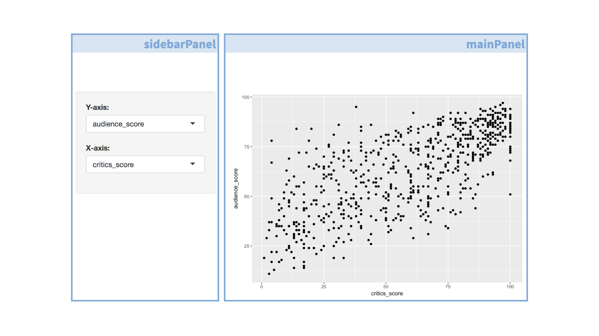
```

This is a simple layout with a narrow sidebar for inputs and a wider main area for output.

Under the hood, Shiny implements layout features available in Bootstrap 2, which is a popular HTML/CSS framework. However the nice thing about working in Shiny is that no prior experience with Bootstrap is necessary. 

To learn more about various layouts, I recommend reviewing the [Application Layout Guide article](https://shiny.rstudio.com/articles/layout-guide.html) at [shiny.rstudio.com](shiny.rstudio.com).

### Input controls

Next we define our sidebar panel containing input controls.

```{r}
knitr::include_graphics("images/input-controls.png")
```

### 

This panel contains two dropdown menus created with the `selectInput()` function.

```{r}
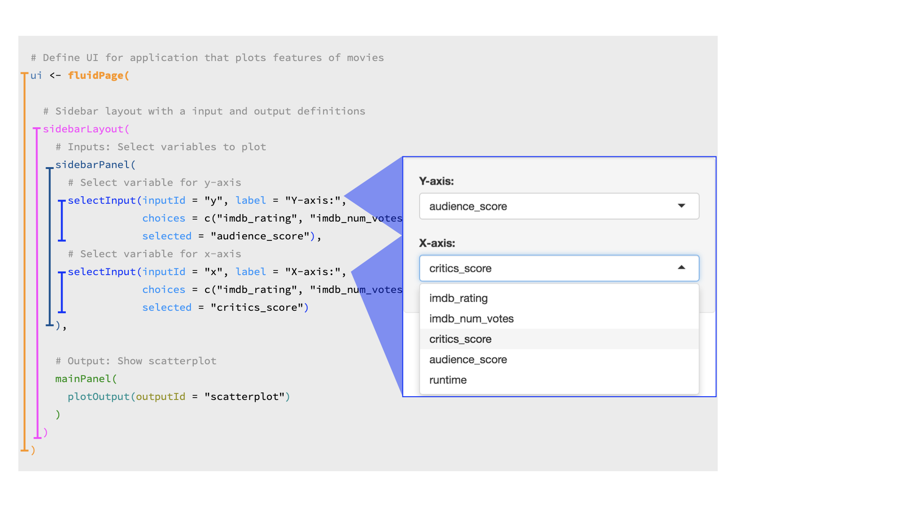
```

###

Let's take a look at one of the `selectInput` widgets a little more closely.

```{r}
knitr::include_graphics("images/input-closeup.png")
```

1. The first argument is the `inputId`, which is the input value that the app will internally use to access the value selected by the user.

1. The second argument is the `label`, which is the display label that the user sees.

1. The third argument is the list of `choices` the user will choose from. In this app, these are variable names from the movies dataset.

1. And lastly we specify a default selection from that list with `selected`.


### Main Panel 

The final component of our UI is `mainPanel()`. 

```{r}
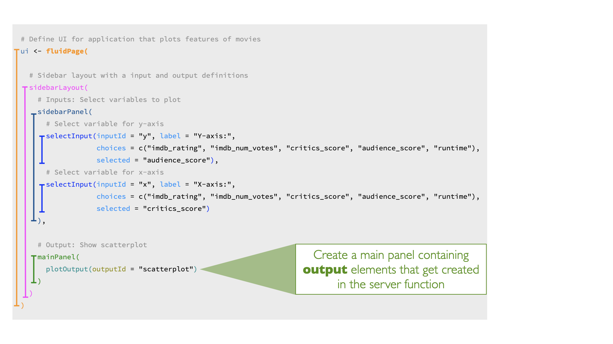
```

Currently the main panel contains only one component, a plot output. We'll talk about how this plot is built later in the tutorial.

Next, let's practice building an app UI!

### Practice: Extend the UI

We'll start with a simplified version of the app you saw in the previous exercise. In this app a `selectInput()` widget is used to allow the user to select which variables should be plotted on the `x` and `y` axes of the scatterplot.

The `selectInput()` function has the following arguments: 

- an `inputId` that is used to refer to the input parameter when building the scatterplot, 
- a list of `choices` to pick from, 
- and a `selected` choice for when the app first launches. 

Note that `choices` takes a named vector, and the name rather than the value (which must match variable names in the data frame) is displayed to the user. 


#### Your turn

- Modify the Shiny app code below, and add a new `selectInput` widget to color the points by a choice of the following variables: `"title_type"`, `"genre"`, `"mpaa_rating"`, `"critics_rating"`, `"audience_rating"`.

- Make the default selection `"mpaa_rating"`.

:::proj

*Complete this exercise by opening up the RStudio Project titled __1-2a Extend the UI__ within your RStudio Cloud Workspace*

[<i class="fa fa-cloud"></i> Go to RStudio Cloud Workspace](https://rstudio.cloud/spaces/81721/join?access_code=I4VJaNsKfTqR3Td9hLP7E1nz8%2FtMg6Xbw9Bgqumv){.btn .test-drive}

:::

```{r ex-1-2a-selectInput, eval = FALSE, echo = TRUE}
# Load packages ----------------------------------------------------------------

library(shiny)
library(ggplot2)

# Load data --------------------------------------------------------------------

load("movies.RData")

# Define UI --------------------------------------------------------------------

ui <- fluidPage(
  
  sidebarLayout(
    
    # Inputs: Select variables to plot
    sidebarPanel(
      
      # Select variable for y-axis
      selectInput(inputId = "y", 
                  label = "Y-axis:",
                  choices = c("imdb_rating", "imdb_num_votes", "critics_score", "audience_score", "runtime"), 
                  selected = "audience_score"),
      
      # Select variable for x-axis
      selectInput(inputId = "x", 
                  label = "X-axis:",
                  choices = c("imdb_rating", "imdb_num_votes", "critics_score", "audience_score", "runtime"), 
                  selected = "critics_score"),
      
      # Select variable for color
      selectInput(inputId = "___", 
                  label = "____",
                  choices = c(___),
                  selected = "___")
      
    ),
    
    # Output: Show scatterplot
    mainPanel(
      plotOutput(outputId = "scatterplot")
    )
  )
)

# Define server ----------------------------------------------------------------

server <- function(input, output, session) {
  
  output$scatterplot <- renderPlot({
    ggplot(data = movies, aes_string(x = input$x, y = input$y,
                                     color = ___)) +
      geom_point()
  })
  
  }

# Create a Shiny app object ----------------------------------------------------

shinyApp(ui = ui, server = server)
```

<details>
<summary>Show solution</summary>

See the following code chunk for the solution to the exercise above. 

```{r ex-1-2a-selectInput-solution, eval = FALSE, echo = TRUE}
# Load packages ----------------------------------------------------------------

library(shiny)
library(ggplot2)

# Load data --------------------------------------------------------------------

load("movies.RData")

# Define UI --------------------------------------------------------------------

ui <- fluidPage(
  
  sidebarLayout(
    
    # Inputs: Select variables to plot
    sidebarPanel(
      
      # Select variable for y-axis
      selectInput(inputId = "y", 
                  label = "Y-axis:",
                  choices = c("imdb_rating", "imdb_num_votes", "critics_score", "audience_score", "runtime"), 
                  selected = "audience_score"),
      
      # Select variable for x-axis
      selectInput(inputId = "x", 
                  label = "X-axis:",
                  choices = c("imdb_rating", "imdb_num_votes", "critics_score", "audience_score", "runtime"), 
                  selected = "critics_score"),
      
      # Select variable for color
      selectInput(inputId = "z", 
                  label = "Color by:",
                  choices = c("title_type", "genre", "mpaa_rating", "critics_rating", "audience_rating"),
                  selected = "mpaa_rating")
      
    ),
    
    # Output: Show scatterplot
    mainPanel(
      plotOutput(outputId = "scatterplot")
    )
  )
)

# Define server ----------------------------------------------------------------

server <- function(input, output, session) {
  
  output$scatterplot <- renderPlot({
    ggplot(data = movies, aes_string(x = input$x, y = input$y,
                                     color = input$z)) +
      geom_point()
  })
  
  }

# Create a Shiny app object ----------------------------------------------------

shinyApp(ui = ui, server = server)
```

</details>

### Practice: Extend the UI further

The potential variables the user can select for the `x` and `y` axes and `color` currently appear in the UI of the app the same way that they are spelled in the data frame header. However we might want to label them in a way that is more human readable. We can achieve this using named vectors for the `choices` argument, in the format of `"Human readable label" = "variable_name"`.

#### Your turn

- Fill in the blanks in the code below with human readable labels for `x` and `y` inputs.
- Re-create the `selectInput` widget for color, `z`, with options `"title_type"`, `"genre"`, `"mpaa_rating"`, `"critics_rating"`, and `"audience_rating"`, default selection `"mpaa_rating"` just like in the previous exercise, but this time use human readable labels as well.

:::proj

*Complete this exercise by opening up the RStudio Project titled __1-2b Extend the UI further__ within your RStudio Cloud Workspace*

[<i class="fa fa-cloud"></i> Go to RStudio Cloud Workspace](https://rstudio.cloud/spaces/81721/join?access_code=I4VJaNsKfTqR3Td9hLP7E1nz8%2FtMg6Xbw9Bgqumv){.btn .test-drive}

:::

```{r ex-1-2b-selectInput-labels, eval = FALSE, echo = TRUE}
# Load packages ----------------------------------------------------------------

library(shiny)
library(ggplot2)

# Load data --------------------------------------------------------------------

load("movies.RData")

# Define UI --------------------------------------------------------------------

ui <- fluidPage(
  
  sidebarLayout(
    
    # Inputs: Select variables to plot
    sidebarPanel(
      
      # Select variable for y-axis
      selectInput(inputId = "y", 
                  label = "Y-axis:",
                  choices = c(___ = "imdb_rating", 
                                 ___ = "imdb_num_votes", 
                                 ___ = "critics_score", 
                                 ___ = "audience_score", 
                                 ___ = "runtime"), 
                  selected = "audience_score"),
      
      # Select variable for x-axis
      selectInput(inputId = "x", 
                  label = "X-axis:",
                  choices = c(___ = "imdb_rating", 
                                 ___ = "imdb_num_votes", 
                                 ___ = "critics_score", 
                                 ___ = "audience_score", 
                                 ___ = "runtime"), 
                  selected = "critics_score"),
      
      # Select variable for color
      selectInput(___)
      
    ),
    
    # Output: Show scatterplot
    mainPanel(
      plotOutput(outputId = "scatterplot")
    )
  )
)

# Define server ----------------------------------------------------------------

server <- function(input, output, session) {
  
  output$scatterplot <- renderPlot({
    ggplot(data = movies, aes_string(x = input$x, y = input$y,
                                     color = input$z)) +
      geom_point()
  })
  
  }

# Create a Shiny app object ----------------------------------------------------

shinyApp(ui = ui, server = server)
```

<details>
<summary>Show solution</summary>

See the following code chunk for the solution to the exercise above. 

```{r ex-1-2b-selectInput-labels-solution, eval = FALSE, echo = TRUE}
# Load packages ----------------------------------------------------------------

library(shiny)
library(ggplot2)

# Load data --------------------------------------------------------------------

load("movies.RData")

# Define UI --------------------------------------------------------------------

ui <- fluidPage(
  
  sidebarLayout(
    
    # Inputs: Select variables to plot
    sidebarPanel(
      
      # Select variable for y-axis
      selectInput(inputId = "y", 
                  label = "Y-axis:",
                  choices = c("IMDB rating"          = "imdb_rating", 
                              "IMDB number of votes" = "imdb_num_votes", 
                              "Critics score"        = "critics_score", 
                              "Audience score"       = "audience_score", 
                              "Runtime"              = "runtime"), 
                  selected = "audience_score"),
      
      # Select variable for x-axis
      selectInput(inputId = "x", 
                  label = "X-axis:",
                  choices = c("IMDB rating"          = "imdb_rating", 
                              "IMDB number of votes" = "imdb_num_votes", 
                              "Critics score"        = "critics_score", 
                              "Audience score"       = "audience_score", 
                              "Runtime"              = "runtime"), 
                  selected = "critics_score"),
      
      # Select variable for color
      # Select variable for color
      selectInput(inputId = "z", 
                  label = "Color by:",
                  choices = c("Title type" = "title_type", 
                              "Genre" = "genre", 
                              "MPAA rating" = "mpaa_rating", 
                              "Critics rating" = "critics_rating", 
                              "Audience rating" = "audience_rating"),
                  selected = "mpaa_rating")
      
    ),
    
    # Output: Show scatterplot
    mainPanel(
      plotOutput(outputId = "scatterplot")
    )
  )
)

# Define server ----------------------------------------------------------------

server <- function(input, output, session) {
  
  output$scatterplot <- renderPlot({
    ggplot(data = movies, aes_string(x = input$x, y = input$y,
                                     color = input$z)) +
      geom_point()
  })
  
  }

# Create a Shiny app object ----------------------------------------------------

shinyApp(ui = ui, server = server)
```

</details>

## 1.3 Server function

Now that you've had some practice with the UI, it's time to move on to the server function.

Again, before we get into the details, let's remind ourselves of the anatomy of a Shiny app. The basic task of the server function is to define the relationship between inputs and outputs.

### Here again is the app that we are working with in this module 

Earlier we saw how to build the UI of this app, and we also noted that each input was tagged with an `inputId` that can be used to refer to them in the server.

```{r}
knitr::include_graphics("images/app-selectinput-scatterplot.png")
```


### This is the server function code for this app

Once again there is a lot going on here to parse at once, so in the following sections we take a closer look at the function.

```{r}
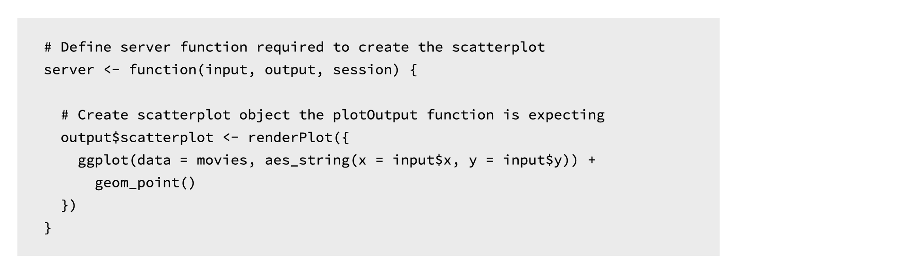
```

### At the outermost layer

```{r}
knitr::include_graphics("images/server-outermost.png")
```

We define our server function which takes two arguments: an `input` and an `output`. Both of these are named lists. 

The server function accesses inputs selected by the user to perform computations and specifies how outputs laid out in the UI should be updated. 

The server function can take on one more argument, `session`, which is an environment that can be used to access information and functionality relating to the session. However this concept is beyond the scope of this tutorial, so for now we'll stick to server functions that only have input and output arguments.

### output

Our simple app had only one output -- a plot. So our server function contains the logic necessary to build this plot.

```{r}
knitr::include_graphics("images/output.png")
```

The `renderPlot()` function specifies how the plot output should be updated. Let's take a look at what is happening in the `renderPlot()` function first.

### `renderPlot()`

```{r}
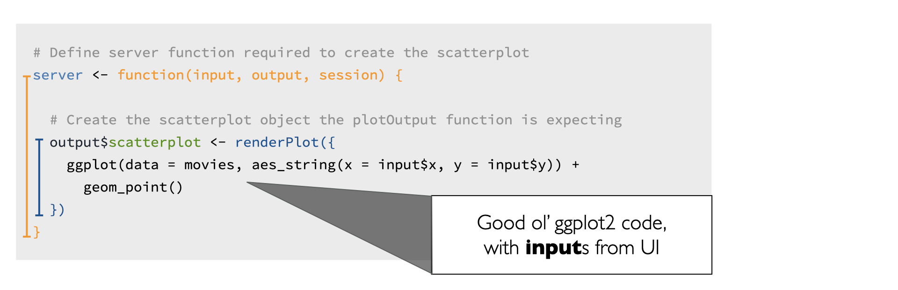
```

This is good ol' ggplot2 code! So even if you're new to shiny, if you've previously used ggplot2 for plotting in R, this syntax should look familiar to you. 

One aspect of the syntax that might be new, however, is how the x and y variables are defined. They come from the input list that is built in the UI.

### Inputs

Here is the relevant UI and server code. 

```{r}
knitr::include_graphics("images/inputs-x-y.png")
```

Input x and y come from the `selectInput()` widgets, and map to the `x` and `y` arguments of the plot aesthetics.

### Rules of server functions

There are three rules of building server functions:

1. Always save objects to display to the named output list, i.e. something of the form `output$xx`, where `xx` is the plot you want to display.

1. Always build objects to display with one of the `render*()` functions, like we built our plot with `renderPlot()`.

1. Use input values from the named input list, with `input$xx`.

### Output types

Just like various inputs, Shiny also provides a wide selection of output types each of which works with a render function.

```{r, out.width = "80%"}
knitr::include_graphics("images/cheatsheet-outputs.png")
```

For example, in our app we used the `renderPlot()` function to build our reactive plot (we'll get to what I mean by reactive in a second) and laid out the plot with the `plotOutput()` function. 

```{r}
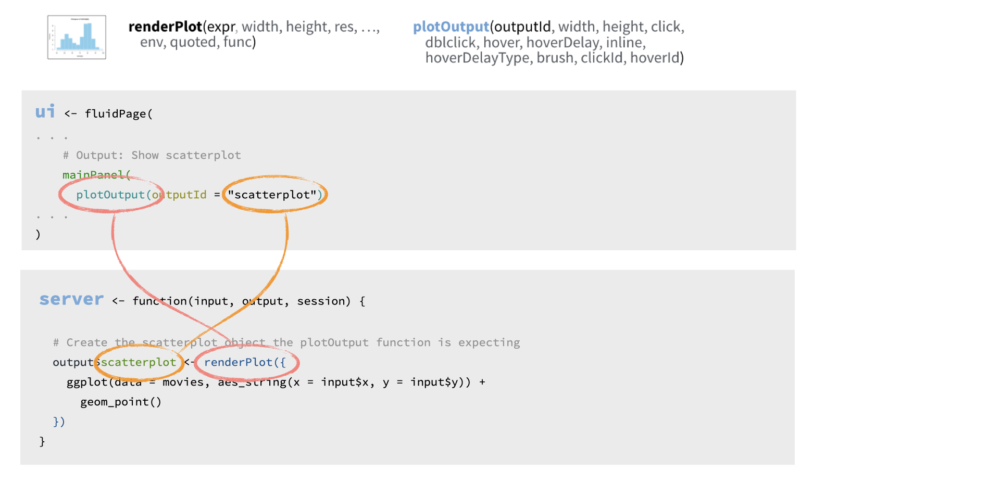
```

Shiny knows to match these two together as they use the same `outputID`, scatterplot.

In the following exercises you'll get a chance to work with other render/output function pairs to add more elements to your app.

### Reactivity

Let's also briefly discuss reactivity. 

```{r, out.width = "80%"}
knitr::include_graphics("images/reactivity.png")
```

It’s easy to build interactive applications with Shiny, but to get the most out of it, you’ll need to understand the reactive programming scheme used by Shiny. 

In a nutshell Shiny automatically updates outputs, such as plots, when inputs that go into them change.

### Putting all the pieces together

Before we wrap up this section, I should also mention the last component of each Shiny app, which is a call to the aptly named `shinyApp()` function, which puts the UI and the server pieces together to create a Shiny app object.

```{r, out.width = "80%"}
knitr::include_graphics("images/shinyAppfunction.png")
```

Time to put this all into practice!


### Practice: Rules of server functions

Which of the following is not true about server functions?

```{r mc-2}
question("Which of the following is not true about server functions?",
  answer("Server functions should include a call to `runApp()`",
    correct = TRUE,
    message = "The `runApp()` function can be used in the Console to run a Shiny application, as an alternative to the Run App button in the RStudio IDE."
  ),
  answer("Objects to be displayed should be saved to `output$`"),
  answer("Reactive objects should be built with `render*()` functions"),
  answer("Input values should be referred to with `input$`"),
  allow_retry = FALSE,
  random_answer_order = TRUE
)
```

### Practice: Fix it up

Below is the code for the Shiny app we built earlier, however currently the code is broken. Specifically there are errors in the definition of the server function as well as in the `mainPanel` of the UI.

#### Your turn 

- Review the app and identify errors in the code
- Fix the errors and test out the app

:::proj

*Navigate to the project called __1-3 Fix it up__ after clicking the button below*

[<i class="fa fa-cloud"></i> Go to RStudio Cloud Workspace](https://rstudio.cloud/spaces/81721/join?access_code=I4VJaNsKfTqR3Td9hLP7E1nz8%2FtMg6Xbw9Bgqumv){.btn .test-drive}

:::

```{r ex-1-3-fixup, eval = FALSE, echo = TRUE}
# Load packages ----------------------------------------------------------------

library(shiny)
library(ggplot2)

# Load data --------------------------------------------------------------------

load("movies.RData")

# Define UI --------------------------------------------------------------------

ui <- fluidPage(
  sidebarLayout(

    # Inputs: Select variables to plot
    sidebarPanel(

      # Select variable for y-axis
      selectInput(
        inputId = "y",
        label = "Y-axis:",
        choices = c(
          "IMDB rating" = "imdb_rating",
          "IMDB number of votes" = "imdb_num_votes",
          "Critics score" = "critics_score",
          "Audience score" = "audience_score",
          "Runtime" = "runtime"
        ),
        selected = "audience_score"
      ),

      # Select variable for x-axis
      selectInput(
        inputId = "x",
        label = "X-axis:",
        choices = c(
          "IMDB rating" = "imdb_rating",
          "IMDB number of votes" = "imdb_num_votes",
          "Critics score" = "critics_score",
          "Audience score" = "audience_score",
          "Runtime" = "runtime"
        ),
        selected = "critics_score"
      ),

      # Select variable for color
      selectInput(
        inputId = "z",
        label = "Color by:",
        choices = c(
          "Title type" = "title_type",
          "Genre" = "genre",
          "MPAA rating" = "mpaa_rating",
          "Critics rating" = "critics_rating",
          "Audience rating" = "audience_rating"
        ),
        selected = "mpaa_rating"
      )
    ),

    # Output: Show scatterplot
    mainPanel(
      plotOutput(outputId = "scatterPlot")
    )
  )
)

# Define server ----------------------------------------------------------------

server <- function(input, output, session) {
  output$scatterplot <- renderTable({
    ggplot(data = movies, aes_string(
      x = x, y = y,
      color = z
    )) +
      geom_point()
  })
}

# Create a Shiny app object ----------------------------------------------------

shinyApp(ui = ui, server = server)
```

```{r ex-1-3-fixup-solution, include = FALSE}
# Load packages ----------------------------------------------------------------

library(shiny)
library(ggplot2)

# Load data --------------------------------------------------------------------

load("movies.RData")

# Define UI --------------------------------------------------------------------

ui <- fluidPage(
  sidebarLayout(

    # Inputs: Select variables to plot
    sidebarPanel(

      # Select variable for y-axis
      selectInput(
        inputId = "y",
        label = "Y-axis:",
        choices = c(
          "IMDB rating" = "imdb_rating",
          "IMDB number of votes" = "imdb_num_votes",
          "Critics score" = "critics_score",
          "Audience score" = "audience_score",
          "Runtime" = "runtime"
        ),
        selected = "audience_score"
      ),

      # Select variable for x-axis
      selectInput(
        inputId = "x",
        label = "X-axis:",
        choices = c(
          "IMDB rating" = "imdb_rating",
          "IMDB number of votes" = "imdb_num_votes",
          "Critics score" = "critics_score",
          "Audience score" = "audience_score",
          "Runtime" = "runtime"
        ),
        selected = "critics_score"
      ),

      # Select variable for color
      selectInput(
        inputId = "z",
        label = "Color by:",
        choices = c(
          "Title type" = "title_type",
          "Genre" = "genre",
          "MPAA rating" = "mpaa_rating",
          "Critics rating" = "critics_rating",
          "Audience rating" = "audience_rating"
        ),
        selected = "mpaa_rating"
      )
    ),

    # Output: Show scatterplot
    mainPanel(
      plotOutput(outputId = "scatterplot")
    )
  )
)

# Define server ----------------------------------------------------------------

server <- function(input, output, session) {
  output$scatterplot <- renderPlot({
    ggplot(data = movies, aes_string(
      x = input$x, y = input$y,
      color = input$z
    )) +
      geom_point()
  })
}

# Create a Shiny app object ----------------------------------------------------

shinyApp(ui = ui, server = server)
```


## 1.4 Recap

Let's quickly recap what we have learned in this chapter.

###

Every Shiny app has a webpage that the user visits, and behind this webpage there is a computer that serves this webpage by running R.

```{r, out.width = "80%"}
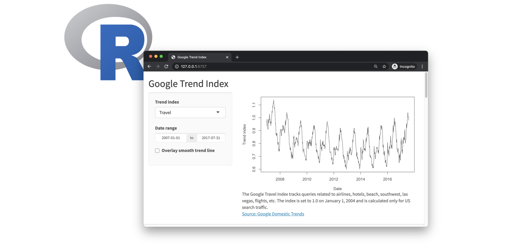
```

### 

When running your app locally, the computer serving your app is your computer.

```{r, out.width = "80%"}
knitr::include_graphics("images/recap-2.png")
```

###

When your app is deployed, the computer serving your app is a web server.

```{r, out.width = "80%"}
knitr::include_graphics("images/recap-3.png")
```

### 

Each app is comprised of two components, a UI and a server. 

```{r, out.width = "80%"}
knitr::include_graphics("images/recap-4.png")
```

- The UI is ultimately built with HTML, CSS, and JavaScript. However, you as the Shiny developer do not need to know these languages. Shiny lets R users write user interfaces using a simple, familiar-looking API. However there are no limits to customization for advanced users who are familiar with these languages.

- The server function contains the instructions to map user inputs to outputs.

I often think of the UI as containing syntax specific to Shiny, and the server as containing R code you might already be familiar with -- with some Shiny functions added to achieve reactivity.

### Change display

In this tutorial you will be developing your apps in RStudio Cloud projects, but once you're done with the tutorial you might consider developing your apps in the RStudio IDE, which has some some handy-dandy functionality for running and viewing your apps. 

RStudio will automatically recognize R scripts that contain `ui` and `server` components and that end with a call to the `shinyApp()` function and will make available the Run App button. You can choose to run your app in a new window, or in the viewer pane of your RStudio window.

```{r, out.width = "80%"}
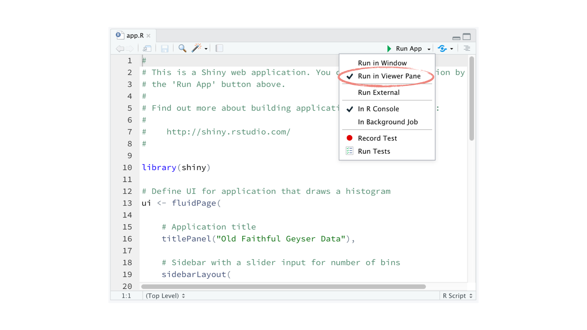
```

### Close an app

When you are done with an app, you can terminate the session by clicking the red stop button in your viewer pane.

```{r, out.width = "80%"}
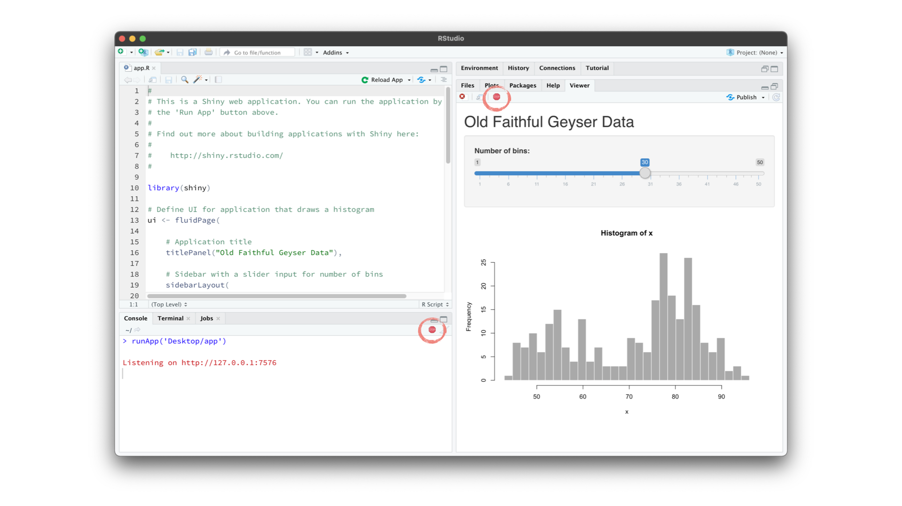
```

### 

That's all for this module! In the next module we discuss inputs, outputs, and rendering functions in further detail.
