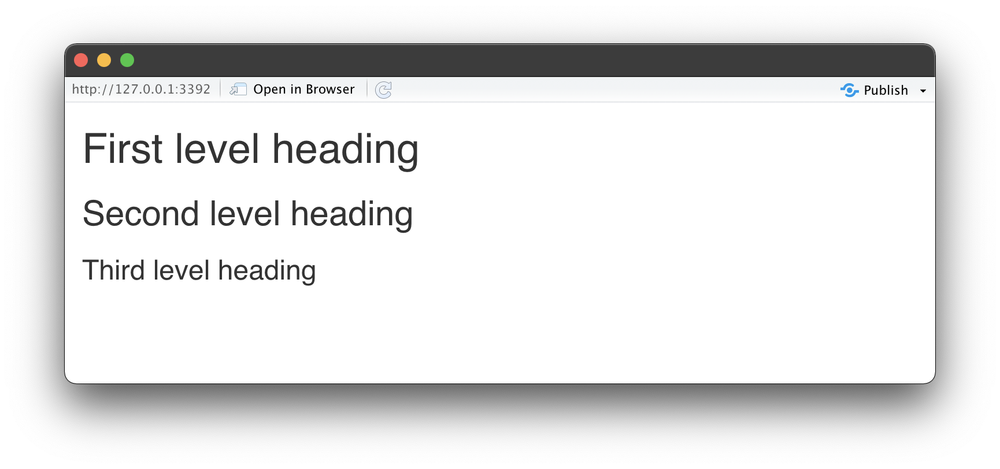
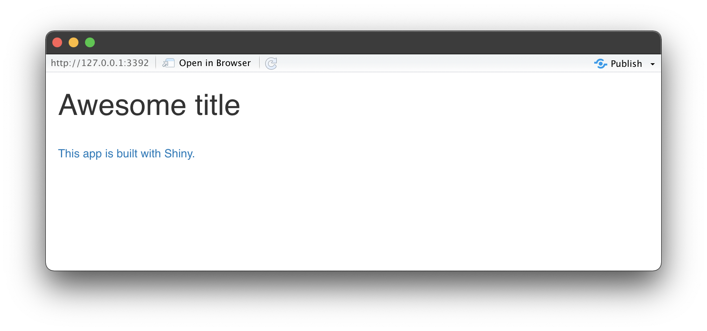
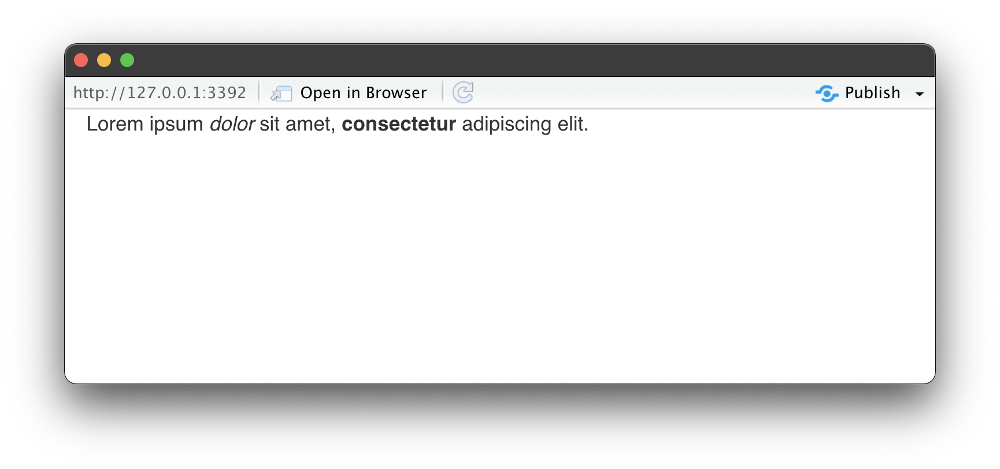

```{r setup, include=FALSE}
library(learnr)
knitr::opts_chunk$set(
  echo = FALSE, 
  fig.align = "center",
  out.width = "100%"
  )
```

## 4.1 Interface builder functions

### 

Earlier in the course we mentioned that the ui is ultimately built with HTML. We actually use R functions to make the ui, but they get translated to HTML. 

In this module we build on this idea to develop more complex app interfaces. More specifically, we discuss **tags**. 

### tags

Shiny comes with a list of functions saved under tags that allow us to access HTML tags and use them to add static (as opposed to reactive) content to our apps. 

The `tags` object in shiny is a list of 100+ simple functions for constructing HTML documents.  

```{r, echo = TRUE, eval = TRUE}
names(tags)
```

* Each of the elements in this list is a function that maps to an HTML tag.

### tag -> HTML

For example, let's use the `b` tag, which is used for bolding text in HTML. The function is `tags$b()`. 

We can pass a text string, in quotation marks, to this function, like "This is my first app". 

```{r, echo= TRUE, eval = FALSE}
tags$b("This is my first app")
```

Then R translates the text string to HTML:  

```
<b>This is my first app</b>  
```

The HTML is then rendered as bolded text when the user sees it:  

```{r, echo=FALSE}
tags$b("This is my first app")
```


### Header tags

So how would we use these tags in building an app? 

We might use the various levels of headers if it makes sense for me to have subheadings in my app. 

For example `tags$h1()`, `tags$h2()`, and `tags$h3()` to create first, second, and third level headings, etc. 

```{r, echo = TRUE, eval = FALSE}
library(shiny)

# Define UI with tags
ui <- fluidPage(
  tags$h1("First level heading"), 
  tags$h2("Second level heading"), 
  tags$h3("Third level heading")
)

# Define server fn that does nothing :)
server <- function(input, output, session) {}

# Create the app object
shinyApp(ui = ui, server = server)
```

{width=50%}

### Linked text

If we have references we want to link to at the bottom of my app, we can use the a tag with the `href` argument for specifying a URL.

```{r, echo = TRUE, eval = FALSE}
library(shiny)

# Define UI with tags
ui <- fluidPage( 
  tags$h1("Awesome title"), 
  tags$br(), # line break 
  tags$a("This app is built with Shiny.", href = "http://shiny.rstudio.com/")
)

# Define server fn that does nothing :)
server <- function(input, output, session) {}

# Create the app object
shinyApp(ui = ui, server = server)
```

{width=50%}

### Nested tags 

We can also nest tags within each other to create something like a new paragraph with the `p` tag and some text in that paragraph where certain words are italicized with the `em` tag and certain are bolded with the `b` tag.

```{r, echo = TRUE, eval = FALSE}
library(shiny)

# Define UI with tags
ui <- fluidPage( 
  tags$p("Lorem ipsum",
         tags$em("dolor"), 
         "sit amet,", 
         tags$b("consectetur"), 
         "adipiscing elit.")
)

# Define server fn that does nothing :)
server <- function(input, output, session) {}

# Create the app object
shinyApp(ui = ui, server = server)
```


{width=50%}


### Common tags

Additionally, the most commonly used tags are wrapped in their own functions and you can use them without the tags list. 

<center>{width=100%}</center>

### 

These are functions like:

* `a()` for anchor text.  

    ```{r, echo = TRUE, eval = FALSE}
    tags$a("Anchor text")
    ```
    ```
    <a>Anchor text</a>
    ```
    ```{r, echo = TRUE, eval = FALSE}
    a("Anchor text")
    ```
    ```
    <a>Anchor text</a>
    ```  


* `br()` for a line break.  

    ```{r, echo = TRUE, eval = FALSE}
    tags$br()
    ```
    ```
    <br>
    ```  
    
    ```{r, echo = TRUE, eval = FALSE}
    br()
    ```
    ```
    <br>
    ```
    
    
    
*   `code()` for displaying code in monospace form  
    ```{r, echo = TRUE, eval = FALSE}
    tags$code("Monospace text")
    ```
    ```
    <code>Monospace text</code>
    ```  
    
    ```{r, echo = TRUE, eval = FALSE}
    code("Monospace text")
    ```  
    
    
    ```
    <code>Monospace text</code>
    ```  
    
    

* And the heading functions we mentioned earlier  
    ```{r, echo = TRUE, eval = FALSE}
    tags$h1("First level header")
    ```  
    ```
    <h1>First level header</h1>
    ```  
    
    ```{r, echo = TRUE, eval = FALSE}
    h1("First level header")
    ```
    ```
    <h1>First level header</h1>
    ```  


The function names correspond to the tag names, and the functions accept text strings as arguments. For example `tags$h1("First level heading")` is equivalent to `h1("First level heading")`.

### HTML

If you're comfortable with HTML, an alternative is to directly use HTML syntax and wrap your HTML code with the HTML function.

```{r, eval = FALSE, echo = TRUE}
HTML("Hello world, <br/> and then a line break.")
```

```
Hello world, <br/> and then a line break.
```

## 4.1 Practice

Next, let's work on some exercises on adding HTML elements to our apps to customize appearance.

These next exercises will demo a few of the simpler interface builder options with HTML code.

### Add text with HTML tags

Add explanatory text to your movie app by using HTML tags in the main panel. We demo an example of this with the code below.

:::proj

*Navigate to the RStudio Cloud Project titled __4-1a Add text with HTML tags__ in your RStudio Workspace to see this code in action*

[<i class="fa fa-cloud"></i> Go to RStudio Cloud Project](https://rstudio.cloud/spaces/81721/join?access_code=I4VJaNsKfTqR3Td9hLP7E1nz8%2FtMg6Xbw9Bgqumv){.btn .test-drive}

:::

```{r, echo = TRUE, eval = FALSE}
library(shiny)
library(ggplot2)
library(tools)
load("movies.RData")

# UI
ui <- fluidPage(
  
  sidebarLayout(
    
    
    # Input
    sidebarPanel(
      
      # Select variable for y-axis
      selectInput(inputId = "y", 
                  label = "Y-axis:",
                  choices = c("IMDB rating" = "imdb_rating", 
                              "IMDB number of votes" = "imdb_num_votes", 
                              "Critics Score" = "critics_score", 
                              "Audience Score" = "audience_score", 
                              "Runtime" = "runtime"), 
                  selected = "audience_score"),
      
      # Select variable for x-axis
      selectInput(inputId = "x", 
                  label = "X-axis:",
                  choices = c("IMDB rating" = "imdb_rating", 
                              "IMDB number of votes" = "imdb_num_votes", 
                              "Critics Score" = "critics_score", 
                              "Audience Score" = "audience_score", 
                              "Runtime" = "runtime"), 
                  selected = "critics_score"),
      
      # Select variable for color
      selectInput(inputId = "z", 
                  label = "Color by:",
                  choices = c("Title Type" = "title_type", 
                              "Genre" = "genre", 
                              "MPAA Rating" = "mpaa_rating", 
                              "Critics Rating" = "critics_rating", 
                              "Audience Rating" = "audience_rating"),
                  selected = "mpaa_rating"),
      
      # Set alpha level
      sliderInput(inputId = "alpha", 
                  label = "Alpha:", 
                  min = 0, max = 1, 
                  value = 0.5),
      
      # Set point size
      sliderInput(inputId = "size", 
                  label = "Size:", 
                  min = 0, max = 5, 
                  value = 2),
      
      # Enter text for plot title
      textInput(inputId = "plot_title", 
                label = "Plot title", 
                placeholder = "Enter text to be used as plot title"),
      
      # Action button for plot title
      actionButton(inputId = "update_plot_title", 
                   label = "Update plot title")
      
    ),
    
    # Output:
    mainPanel(
      
      # Explanatory text:
      tags$br(),
      tags$p("These data were obtained from",
             tags$a("IMBD", href = "http://www.imbd.com/"), "and", 
             tags$a("Rotten Tomatoes", href = "https://www.rottentomatoes.com/"), "."), 
      tags$p("The data represent", nrow(movies), "randomly sampled movies released between 1972 to 2014 in the United States."), 
      
      plotOutput(outputId = "scatterplot")

    )
  )
)

# Define server function required to create the scatterplot-
server <- function(input, output, session) {
  
  new_plot_title <- eventReactive(eventExpr = input$update_plot_title, 
                                  valueExpr = { toTitleCase(input$plot_title) }
  )
  
  # Create scatterplot object the plotOutput function is expecting 
  output$scatterplot <- renderPlot({
    ggplot(data = movies, aes_string(x = input$x, y = input$y, color = input$z)) +
      geom_point(alpha = input$alpha, size = input$size) +
      labs(title = new_plot_title())
  })
}

# Create a Shiny app object
shinyApp(ui = ui, server = server)

```


### Add image with img tag

Now let's practice adding an image to a very simple app.  

Note that if you'd like to use a local image for with your app, you'll first have to save the image in a folder `www/` within your root directory. You'll see what I mean when you run the demo in the RStudio Cloud Project.

:::proj

*Navigate to the RStudio Cloud Project titled __4-1b Add image with img tag__ in your RStudio Workspace for the demo*

[<i class="fa fa-cloud"></i> Go to RStudio Cloud Project](https://rstudio.cloud/spaces/81721/join?access_code=I4VJaNsKfTqR3Td9hLP7E1nz8%2FtMg6Xbw9Bgqumv){.btn .test-drive}

:::


```{r solution, include = FALSE}
library(shiny)

ui <- fluidPage(
  titlePanel("Add 2"),
  tags$img(height = 100, width = 300, src = "roles_implement.png"),
  sidebarLayout(
    sidebarPanel( sliderInput("x", "Select x", min = 1, max = 50, value = 30) ),
    mainPanel( textOutput("x_updated") )
  )
)

server <- function(input, output, session) {
  add_2            <- function(x) { x + 2 }
  current_x        <- reactive({ add_2(input$x) })
  output$x_updated <- renderText({ current_x() })
}

shinyApp(ui, server)
```

## 4.2 Layout Panels

In this section we discuss the layout of a Shiny app.

### `fluidRow()`

One useful function for customizing the layout of your app is `fluidRow()`. This function creates horizontal rows where objects can be placed. 

You can add as many rows as you want, but you want to be careful about expanding your app too much vertically as your users might not be willing to scroll down to interact with your app in full.

<center>
{width=100%}

</center>

### `column()`

The column function is also incredibly useful. It adds columns within a row, and it requires that you define a width for each column. 

<center>
{width=100%}

</center>

### The width is relative

The total width of columns within any given row should add up to 12. You can use the columns to place output objects like a plots or summary tables in specific places in your app.

{width=100%}

### Panels

We can use panels to group multiple elements into a single element that has its own properties.

This is especially important and useful for complex apps with a large number of inputs and outputs such that it might not be clear to the user where to get started.

### `wellPanel()`

The `wellpanel()` function groups elements into a grey well, or a box with rounded corners. This is a look you should be used to seeing in shiny apps by now.

{width=100%}

### Panels

Shiny offers 12 different panels, but we'll take a look at a small subset of them in this section, and then you'll get to work with a few others in the exercises that follow.

{width=60%}


### `sidebarPanel()` and `mainPanel()`

We have made heavy use of `sidebarPanel()` and `mainPanel()` in our apps in this course. However we mostly stuck with their default widths. 

{width=100%}

* The default width for a `sidebarPanel()` is 4 and for a `mainPanel()` is 8. 

### 
If we wanted to make an app where the `sidebar` and `mainPanel` are of equal width, so the app is split down the middle, we can specify a width argument to the `sidebarPanel()` and `mainPanel()` functions and set each to 6. 

{width=100%}

### `titlePanel()`

The `titlePanel()` is used to create a panel containing an application title. Often it makes sense to include this panel outside the `sidebarLayout()`. But in addition to the title on the page, we might want to also change the text that shows up on the browser tab for our app, especially if our title is long. 

{width=100%}

### `titlePanel()` with `windowTitle`

To customize this text we specify the `windowTitle` argument in the `titlePanel()`, which is by default equal to the application title. For example, my application title might be "Movie browser, 1970 to 2014", but I might just want to make my windowTitle "Movies".

{width=100%}

### `conditionalPanel()`

The last panel we'll consider is `conditionalPanel()`, which creates a panel that is visible conditional upon the value of an input or an output. 

{width=80%}

{width=80%}


{width=80%}

* Under the hood this function evaluates a JavaScript expression once at startup and then whenever Shiny detects a relevant change or input/output. 

* Being able to display panels conditional on previous user selections is a powerful feature of Shiny. 

Next, we'll learn about tabs and tabset panels. Let's get to it!

## 4.3 Tabs and tabset panels
###

If the amount of information you want to communicate to your users does not fit well on a page, or there is detailed information, like raw data, that you want to make available to your users but not necessarily feature prominently in your app, you can make use of tabs to distribute this information to stackable tab panels.

### `tabsetPanel()` and `tabPanel()`

Tabsets are created by calling the `tabsetPanel()` function with a list of tabs created by `tabPanel()`.

{width=100%}


### `tabPanel()`
Each tab panel has a unique title and a list of output elements which are rendered vertically within the tab. In this  example we display a plot of our data in the first tab, 

{width=100%}


### 
summary statistics in the second tab,

{width=100%}


### 
raw data in the third tab, 

{width=100%}


### 
and some background information on our dataset in the fourth tab.

{width=100%}


### Tabs and reactivity

Note that in the previous example the user first selected a sample of the data. Then this new sampled data got used in four separate tabs.

{width=100%}

Introducing tabs into our user interface underlines the importance of creating reactive expressions for shared data.   

If the dataset is expensive to compute, then the user interface could be slow to render if each tab were required to do the computation. 

Instead, we calculate the data once in a reactive expression, and then have the result be shared by all of the output tabs.

### `navlistPanel()`

Another option for laying out tabs is using the `navlistpanel()`, which lists the tabs vertically down the side, as opposed to horizontally across the screen.

{width=100%}

### Tabs

To recap, we use tab panels to create stackable panels, and use `tabsetPanel()` or `navlistPanel()` to arrange the tabs with a navigation across the page or down the side of the page.

<center> {width=80%} </center>


### shinythemes

There are many other ways of customizing the look of your app, including using custom CSS. However one quick and easy way of changing the look is using the prebuilt themes in the `shinythemes` package. 

<center> {width=90%} </center>

In order to use one of these themes, we need to load the `shinythemes` package first. The package website has thumbnail images of each of the themes, but it can be difficult to tell exactly how the theme will look on your app. 

### `themeSelector()`

A useful tool for browsing  themes is the `themeSelector()` widget. To use this widget, simply add the widget to your app. 

It can be inserted anywhere inside of the application, although if it is put inside a tab, it will be visible only when that tab is showing. I usually place it right underneath the `fluidPage()` definition. 

{width=90%}

This widget is to be used in development only. Once you decide on a theme, you should remove the widget and just define the theme you want using the `shinytheme()` function.

### 
Next up you get to build an app with tabs and see how it looks with different shiny themes.


## 4.3 Practice

### Customize the appearance of your app with shinythemes

Pick a theme and apply to the existing app.
https://rstudio.github.io/shinythemes/


:::proj

*Complete the exercise by navigating to the RStudio Cloud Project titled __4-3 Customize the appearance of your app with shinythemes__ in your RStudio Workspace*

[<i class="fa fa-cloud"></i> Go to RStudio Cloud Project](https://rstudio.cloud/spaces/81721/join?access_code=I4VJaNsKfTqR3Td9hLP7E1nz8%2FtMg6Xbw9Bgqumv){.btn .test-drive}

:::


## 4.4 Congratulations!

You now know how to get started with building web apps in R with Shiny! 

### What did we learn?

In this course you have learned:

* How to design a Shiny app from scratch
* The essentials of reactive programming
* You also got practice with customizing your app's UI
* Employing reactivity best practices

I hope you enjoyed the course and that the topics we discussed in this course motivated you to build your first, and second, and third Shiny app! 

Once you build your first app, you have a variety of deployment options.

### shinyapps.io

The first is shinyapps.io. This is a server maintained by RStudio, that is easy to use, secure, and scalable. It comes with built in metrics and has a free tier available.

### Shiny Server

If you prefer to build your own server you can use Shiny Server, which is free and open source. It runs on premises, moving your computation closer to your data.

### Pro options

RStudio also offers two Pro options for deploying your apps: Shiny Server Pro and RStudio Connect. You can find out more about all of these options at https://shiny.rstudio.com/deploy.

### Congratulations!

What we covered in this course is just the tip of the Shiny iceberg, so I hope you decide to dive deeper to learn more. 

We can't wait to see the apps you create online! 

