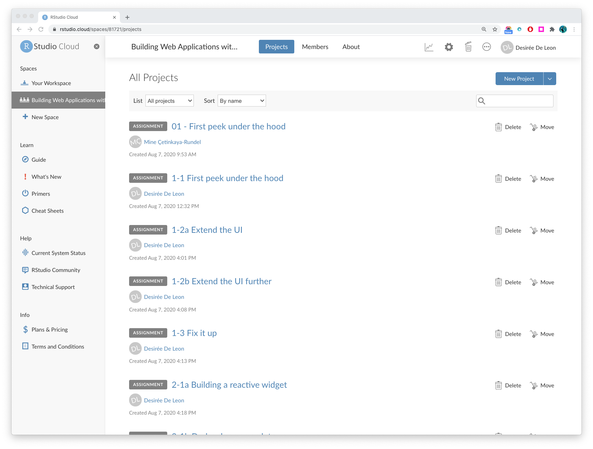

```{r setup, include = FALSE}
knitr::opts_chunk$set(
  echo = FALSE, 
  fig.align = "center",
  out.width = "80%"
  )
```

### Welcome!

This is a short course that will introduce you to Shiny. 

### How it works

The course is organized into four modules, which you can access with the navigation bar above. 

### Getting practice

This course contains practice exercises where you will have the opportunity build and modify a Shiny app yourself. 

When you encounter an exercise in the modules, you will see a button that looks something like this:

:::proj

*Navigate to the project called __1-3 Fix it up__ after clicking the button below*

[<i class="fa fa-cloud"></i> Go to RStudio Cloud Workspace](https://rstudio.cloud/spaces/81721/join?access_code=I4VJaNsKfTqR3Td9hLP7E1nz8%2FtMg6Xbw9Bgqumv){.btn .test-drive}


:::

This button will link to an RStudio Cloud Workspace for this course, where I have set up a project for each of the exercises. Each of the projects contains code for you to play with, modify, and run!

```{r fig.cap = "The course workspace"}

```

```{r fig.cap = "A project with the code necessary for one of the practice questions"}
knitr::include_graphics("images/cloudproject.png")
```

The last project in this workspace contains Shiny scripts with the solutions in case you get stuck.


### Running the app locally

If you don't want to work in RStudio Cloud projects, you can instead choose to run the code locally in your own RStudio IDE. To go this route, make sure you:

1. Download the file containing the data set with the link below, and save it in the RStudio Project you'll be working out of. We will use this file throughout the course. 

    ```{r include = TRUE}

    # install and load these packages
    # devtools::install_github('yihui/xfun')

    # embed_file() requires a few more packages
    xfun::pkg_load2(c('base64enc', 'htmltools', 'mime'))
    ```

    ```{r include = TRUE}
    # a embed single file
    xfun::embed_file(path = "movies.RData", text = paste("Download movies.RData") )        
    ```


2. Copy and paste the code for the each exercise, which you'll find at the end of each exercise question. 

```{r fig.cap = "Copy to clipboard"}
knitr::include_graphics("images/copyclipboard.png")
```

### Ready, steady, go!

Time to give this Shiny course a whirl!
